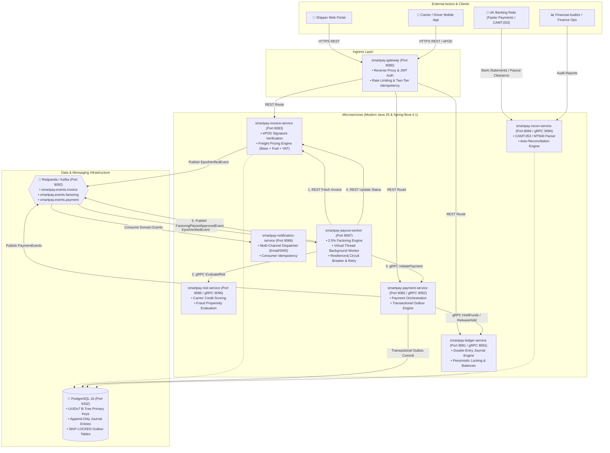

# SmartPay: Modern Logistics Payment, Double-Entry Ledger & Factoring Platform

[-orange.svg)](https://openjdk.org/projects/jdk/25/)
[](https://spring.io/projects/spring-boot)
[](https://www.postgresql.org/)
[](https://grpc.io/)
[](https://redpanda.com/)
[](https://resilience4j.readme.io/)
[](https://www.archunit.org/)

---

## 📖 What is SmartPay? (Project Overview for First-Time Readers)

### 🚛 The Real-World Industry Problem
In UK and European commercial freight logistics, transport operators and independent carriers face crippling cashflow bottlenecks:
1. **Net-30 to Net-90 Payment Terms**: Shippers typically settle freight invoices 30 to 90 days after delivery. Carriers, however, must immediately pay for fuel, truck leases, and driver wages.
2. **Fragile Paperwork & Disputes**: Traditional proof of delivery (POD) involves physical paper notes that get lost, delayed, or disputed, delaying payments for weeks.
3. **Double-Spending & Reconciliation Chaos**: Financial teams manually match bank statement lines to invoices and ledger accounts, resulting in reconciliation backlogs, audit risk, and accounting discrepancies.

### 💡 The SmartPay Solution
**SmartPay** is an enterprise-grade, event-driven financial logistics platform that automates the entire invoice-to-settlement lifecycle in **sub-second real-time**:

```
[ Cargo Delivery ] ──▶ [ Cryptographic ePOD ] ──▶ [ Automated Invoice ] ──▶ [ Instant Factoring Payout (<1s) ] ──▶ [ Bank Statement Recon ]
```

1. **Cryptographic Electronic Proof of Delivery (ePOD)**:
   Drivers record delivery completions with GPS geolocation, delivery photos, and immutable SHA-256 cryptographic signature digests.
2. **Automated Freight Pricing Engine**:
   Invoices are generated dynamically based on vehicle type (Articulated Lorry, Rigid Truck, Van), mileage rates, dynamic fuel surcharges (12%), and statutory VAT (20%) using precision `Money` value objects.
3. **Instant Carrier Factoring Liquidity (< 1s Payout)**:
   Upon ePOD verification, carriers receive instant factoring liquidity (gross invoice minus a 2.5% platform fee) disbursed directly over bank rails (Faster Payments / VRP) without waiting 30–90 days.
4. **Luca Pacioli Double-Entry Ledger**:
   An immutable, append-only financial general ledger enforcing the strict zero-sum invariant: $\sum \text{Debits} == \sum \text{Credits}$. Balances are guarded against double-spending and deadlocks via strict account-order pessimistic locking.
5. **Two-Tier Distributed Idempotency**:
   Cryptographic SHA-256 request fingerprinting paired with database locks ensures that client retries or network replays never produce duplicate withdrawals or payments.
6. **Automated Bank Reconciliation**:
   Parses ISO 20022 CAMT.053 XML and SWIFT MT940 bank statement feeds, auto-matching statement entries against ledger records via unique `end_to_end_id` tokens.

---

## 🏗️ System Architecture & Event Flow

The platform is structured into bounded contexts interacting via **gRPC over HTTP/2** for synchronous internal RPC, **REST (OpenAPI 3.1)** for public ingress, and **Redpanda (Kafka API)** for event streaming.



---

## 📑 Complete Documentation Hub

Comprehensive architectural specifications, design decision records, and story cards are organized under `docs/`:

### 🏛️ Architecture & Deep-Dive Technical Guides
* 🗺️ [**High-Level Architecture & Bounded Contexts**](docs/architecture/high-level-architecture.md): DDD bounded contexts, strategic domain boundaries, and integration protocols.
* ⚙️ [**Low-Level Architecture & Algorithms**](docs/architecture/low-level-architecture.md): Concurrency control, pessimistic lock ordering, Luca Pacioli zero-sum balance algorithm, and UUIDv7 indexing.
* 🏛️ [**C4 Architecture Models (Context, Container, Component, Code)**](docs/architecture/c4-architecture-models.md): Complete C4 model diagrams and container interactions.
* 🔄 [**Sequence Diagrams**](docs/architecture/sequence-diagrams.md): End-to-end execution sequences for ePOD delivery, factoring advances, balance transfers, and bank reconciliations.
* 👥 [**Use Case Diagrams**](docs/architecture/usecase-diagrams.md): Actor use case boundaries across Shippers, Carriers, Bank Rails, and Finance Ops.
* 📘 [**gRPC & Protocol Buffers Technical Guide**](docs/architecture/grpc-technical-guide.md): Protobuf contract specifications, client stubs, deadlines, and error handling.

---

### 📜 Architecture Decision Records (ADRs)
* 📑 [**ADR Index & Architecture Governance**](docs/decisions/README.md)
* [**ADR-001: Adoption of Modern Java 25 & Spring Boot 4.1**](docs/decisions/ADR-001-modern-java-25-and-spring-boot-4.md)
* [**ADR-002: UUIDv7 Primary Keys for Time-Ordered Database Performance**](docs/decisions/ADR-002-uuidv7-primary-keys.md)
* [**ADR-003: Double-Entry Immutable General Ledger Engine**](docs/decisions/ADR-003-double-entry-immutable-ledger.md)
* [**ADR-004: gRPC over HTTP/2 for Internal Microservice Communication**](docs/decisions/ADR-004-grpc-internal-service-communication.md)
* [**ADR-005: Transactional Outbox Pattern for At-Least-Once Delivery**](docs/decisions/ADR-005-transactional-outbox-event-driven.md)
* [**ADR-006: Two-Tier Distributed Idempotency with SHA-256 Fingerprinting**](docs/decisions/ADR-006-two-tier-distributed-idempotency.md)
* [**ADR-007: Redpanda for C++20 Kafka-Compatible Event Streaming**](docs/decisions/ADR-007-redpanda-for-local-development.md)
* [**ADR-008: Event-Driven Kafka Consumer Groups for Kubernetes Concurrency**](docs/decisions/ADR-008-event-driven-worker-concurrency-in-kubernetes.md)

---

### 📑 API Specifications (OpenAPI 3.1 & Protocol Buffers)
* 🌐 [**OpenAPI Specifications Overview**](docs/openapi/README.md)
* 🚪 [**API Gateway Public Ingress (OpenAPI 3.1)**](docs/openapi/gateway-api.yaml)
* 📄 [**Freight Invoicing & ePOD Service API (OpenAPI 3.1)**](docs/openapi/invoice-service-api.yaml)
* 💳 [**Payment Orchestration Service API (OpenAPI 3.1)**](docs/openapi/payment-service-api.yaml)
* 🏦 [**Bank Reconciliation Service API (OpenAPI 3.1)**](docs/openapi/recon-service-api.yaml)
* 📦 [**Protocol Buffers Contracts (`smartpay-proto`)**](smartpay-proto/src/main/proto/) (`ledger.proto`, `payment.proto`, `risk.proto`, `common.proto`)

---

### 📋 Feature Stories & Engineering Epics
* 🗂️ [**Story Roadmap, Sequence & Dependency Matrix**](docs/stories/README.md)
* ✅ [**STORY-001: Double-Entry Ledger & Atomic Transfer Engine**](docs/stories/STORY-001-ledger-double-entry-engine.md)
* ✅ [**STORY-002: Freight Invoicing & ePOD Pricing Engine**](docs/stories/STORY-002-invoice-epod-pricing-engine.md)
* ✅ [**STORY-003: Payment Initiation & Transactional Outbox**](docs/stories/STORY-003-payment-initiation-outbox.md)
* ✅ [**STORY-004: Carrier Factoring & Instant Payout Worker**](docs/stories/STORY-004-payout-factoring-worker.md)
* ✅ [**STORY-005: Bank Statement & Auto-Reconciliation Engine**](docs/stories/STORY-005-bank-reconciliation-engine.md)
* ⏳ [**STORY-006: API Gateway & Distributed Idempotency Filter**](docs/stories/STORY-006-api-gateway-idempotency.md)
* ⏳ [**STORY-007: Carrier Credit Risk & Fraud Engine**](docs/stories/STORY-007-carrier-risk-fraud-engine.md)
* ⏳ [**STORY-008: Event-Driven Multi-Channel Notification Engine**](docs/stories/STORY-008-event-driven-notifications.md)
* ⏳ [**TECH-001: Containerization & K8s Kustomize Engine**](docs/stories/TECH-001-containerization-kustomize-manifests.md)
* ⏳ [**TECH-002: Enterprise CI Pipeline Automation**](docs/stories/TECH-002-ci-pipeline-automation.md)
* ⏳ [**TECH-003: KinD Cluster & E2E Smoke Testing Pipeline**](docs/stories/TECH-003-kind-e2e-testing-pipeline.md)

---

### ⚠️ Technical Debt & Engineering Standards
* 🏛️ [**Agent & Architectural Coding Standards**](AGENTS.md)
* ⚠️ [**TD-001: Currency Master Definitions Table**](docs/tech-debt/TD-001-currency-definitions-master-table.md)
* ⚠️ [**TD-002: Test Directory Physical Partitioning**](docs/tech-debt/TD-002-test-directory-physical-partitioning.md)

---

## 🌐 Service Port Matrix

| Service | Module | HTTP Port | gRPC Port | Database (Schema) | Primary Responsibility |
| :--- | :--- | :--- | :--- | :--- | :--- |
| **API Gateway** | `smartpay-gateway` | `8080` | — | `smartpay_db` (`gateway`) | Reverse proxy, JWT auth, rate limiting, two-tier SHA-256 idempotency filter |
| **Ledger Service** | `smartpay-ledger-service` | `8081` | `9091` | `smartpay_db` (`ledger`) | Double-entry journal posting, balance transfers, hold/release lifecycle |
| **Payment Service** | `smartpay-payment-service` | `8082` | `9092` | `smartpay_db` (`payment`) | Faster Payments / VRP orchestration, Transactional Outbox (`SKIP LOCKED`) |
| **Invoice Service** | `smartpay-invoice-service` | `8083` | `9093` | `smartpay_db` (`invoice`) | ePOD signature verification, freight pricing (base + fuel + VAT) |
| **Recon Service** | `smartpay-recon-service` | `8084` | `9094` | `smartpay_db` (`recon`) | CAMT.053 XML / MT940 bank statement reconciliation engine |
| **Risk Service** | `smartpay-risk-service` | `8085` | `9095` | `smartpay_db` (`risk`) | Carrier credit scoring, exposure limits, fraud propensity evaluation |
| **Notification Svc** | `smartpay-notification-service`| `8086` | `9096` | `smartpay_db` (`notification`) | Event-driven Email / SMS notification dispatcher |
| **Payout Worker** | `smartpay-payout-worker` | `8087` | — | Stateless | Virtual Thread factoring payout background worker with Resilience4j |
| **PostgreSQL 16** | `postgres` | `5432` | — | `smartpay_db` | Shared ACID database; each service owns an isolated PostgreSQL schema (`ledger`, `invoice`, `payment`, `recon`, …) with B-Tree UUIDv7 indexes |
| **Redpanda Broker** | `redpanda` | `9092` | — | — | Lightweight C++20 event streaming broker (Kafka wire-compatible) |
| **Redpanda Console**| `redpanda-console` | `8090` | — | — | Topic and message monitoring dashboard (`http://localhost:8090`) |

---

## 🛠️ Local Environment & Quick Start

### 1. Prerequisites
* **Java 25 (Project Loom Virtual Threads)**:
  ```bash
  # Via SDKMAN:
  sdk install java 25-open
  # Verify:
  java -version # OpenJDK 25
  ```
* **Apache Maven 3.9+**:
  ```bash
  mvn -version
  ```
* **Docker & Docker Compose**:
  ```bash
  docker compose version
  ```

---

### 2. Start Infrastructure
Launch PostgreSQL 16, Redpanda (Kafka API), and Redpanda Console:
```bash
docker compose up -d
```
* **PostgreSQL**: `localhost:5432` (`smartpay_db`, user: `smartpay`, pass: `smartpay`)
* **Redpanda**: `localhost:9092`
* **Redpanda Console**: Open `http://localhost:8090`

> **Schema isolation**: All services share one PostgreSQL database (`smartpay_db`), but each microservice owns an isolated schema — `ledger`, `invoice`, `payment`, `recon`, `gateway`. On first startup every service's Flyway run creates its own schema automatically (`spring.flyway.create-schemas: true`) and applies its per-service migrations (each service's `db/migration` folder restarts at `V1`), so no schema provisioning is required beforehand.

---

### 3. Build Contracts & Project
Compile Protocol Buffers and build all microservice modules:
```bash
# Compile protobuf contracts first
mvn compile -pl smartpay-proto

# Build all modules
mvn compile
```

---

### 4. Running Test Suites

SmartPay strictly separates fast in-memory unit tests from containerized integration suites using JUnit 5 tags:

#### 🟢 Fast Unit Tests (`mvn test -Punit`)
Executes all pure in-memory unit tests (domain models, pricing math, MapStruct mappers, calculation engines, and ArchUnit architecture fitness rules) with **zero Docker/container footprint** in $< 12\text{ seconds}$:
```bash
# Run unit tests across all active modules:
mvn test -Punit -pl smartpay-common,smartpay-ledger-service,smartpay-invoice-service,smartpay-payment-service,smartpay-payout-worker
```

#### 🔵 Full Integration Tests (`mvn test -Pintegration`)
Executes full-stack integration suites against Testcontainers PostgreSQL 16, WireMock HTTP endpoints, HTTP/2 gRPC channels on Virtual Threads, and Resilience4j circuit breakers:
```bash
mvn test -Pintegration -pl smartpay-payout-worker,smartpay-ledger-service,smartpay-payment-service
```

---

### 5. Running Microservices Locally
Services can be launched independently using the Spring Boot Maven plugin:

```bash
# 1. Start Ledger Service (HTTP: 8081, gRPC: 9091)
mvn spring-boot:run -pl smartpay-ledger-service

# 2. Start Invoice & ePOD Service (HTTP: 8083)
mvn spring-boot:run -pl smartpay-invoice-service

# 3. Start Payment Service (HTTP: 8082)
mvn spring-boot:run -pl smartpay-payment-service

# 4. Start Payout Factoring Worker (HTTP: 8087)
mvn spring-boot:run -pl smartpay-payout-worker

# 5. Start API Gateway (HTTP: 8080)
mvn spring-boot:run -pl smartpay-gateway
```
