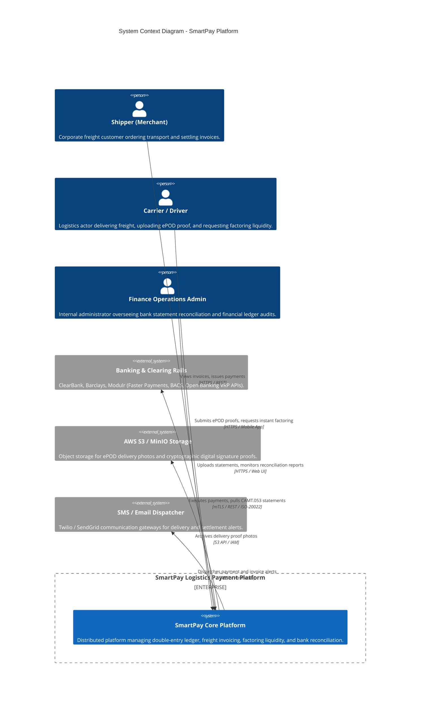
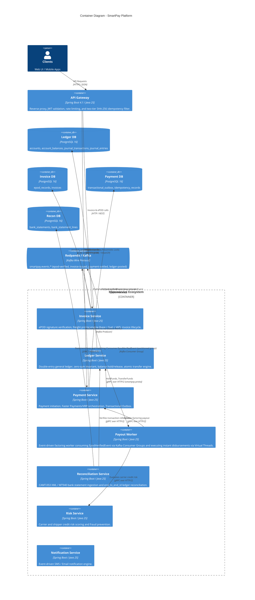
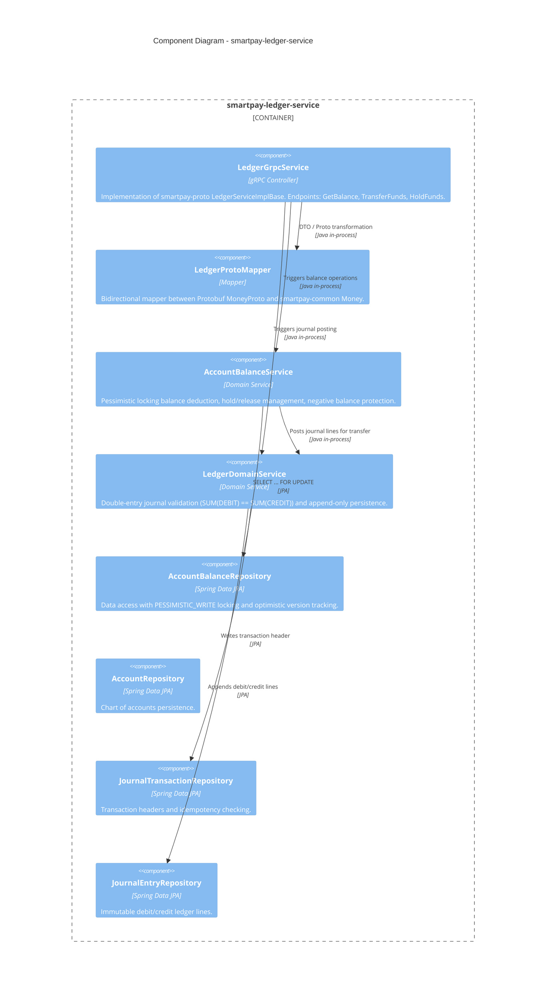
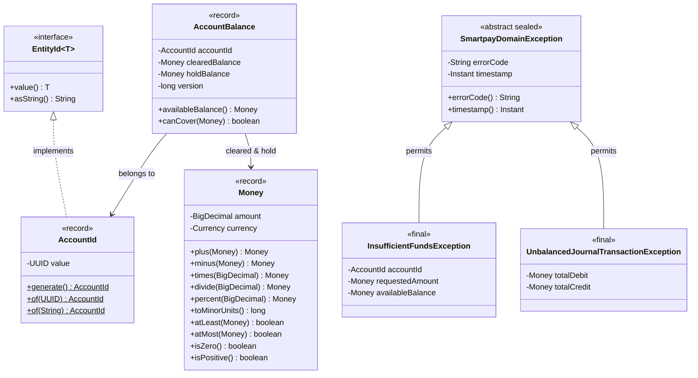

# C4 Architecture Models

This document presents the layered architecture diagrams for the SmartPay Logistics Payment Platform following the **C4 Model** (Context, Container, Component, Code) standard.

---

## 🏛️ Level 1: System Context Diagram

Illustrates the SmartPay platform within its operating environment, detailing human actors and external banking/logistics systems.

---

## 📦 Level 2: Container Diagram

Depicts the microservices, data stores, and communication protocols (gRPC, Kafka, REST) that constitute the SmartPay platform.

---

## 🧩 Level 3: Component Diagram (Ledger Service)

Breaks down the internal architecture of `smartpay-ledger-service`, Platform's core double-entry accounting engine.

---

## 💻 Level 4: Code Diagram (Core Domain Model)

Demonstrates the object-oriented and record-based domain model implemented in `smartpay-common`.

