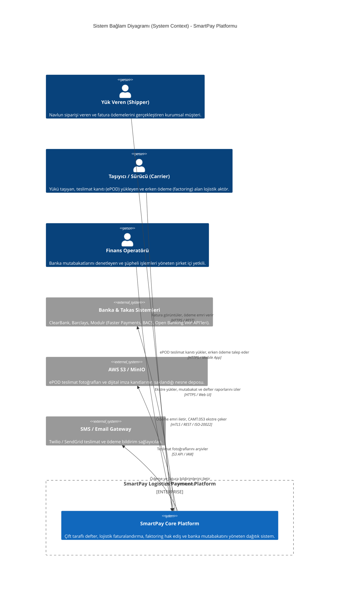
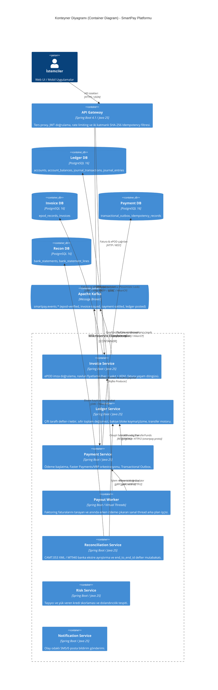
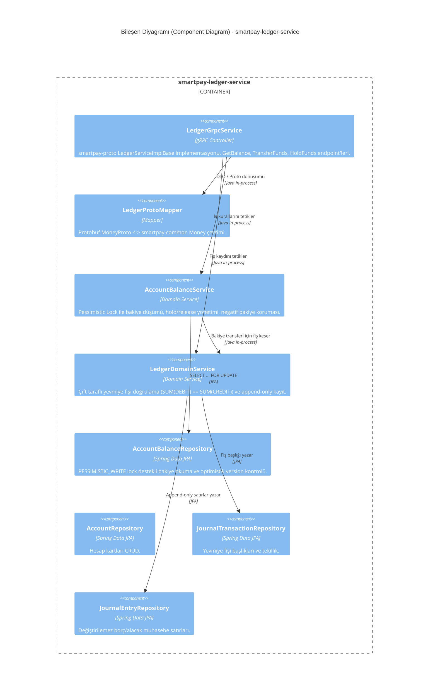
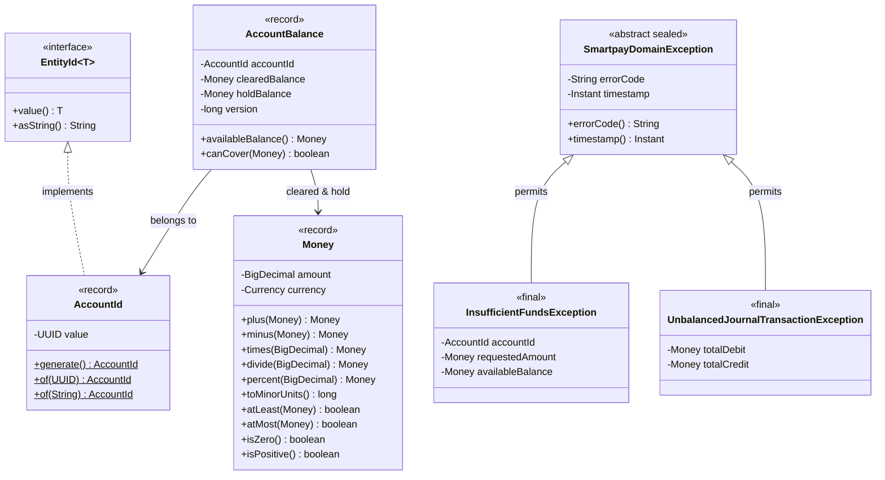

# C4 Mimari Modelleri (C4 Architecture Models)

Bu doküman, SmartPay Lojistik Ödeme ve Fintek Platformu'nun **C4 Model** (Context, Container, Component, Code) standardına göre katmanlı mimari diyagramlarını içerir.

---

## 🏛️ Seviye 1: Sistem Bağlam Diyagramı (System Context Diagram)

SmartPay platformunun dış dünya aktörleri ve entegre olduğu harici finansal/lojistik sistemlerle ilişkisini gösterir.

---

## 📦 Seviye 2: Konteyner Diyagramı (Container Diagram)

SmartPay platformunu oluşturan mikroservisleri, veri depolarını ve servisler arası iletişim protokollerini (gRPC, Kafka, REST) gösterir.

---

## 🧩 Seviye 3: Bileşen Diyagramı (Component Diagram - Ledger Service)

Platformun en kritik bileşeni olan `smartpay-ledger-service` modülünün iç mimari yapısını ve katmanlarını gösterir.

---

## 💻 Seviye 4: Kod / Sınıf Diyagramı (Code Diagram - Domain Core)

`smartpay-common` içindeki çekirdek domain modellerinin nesne yönelimli ve record temelli tasarımını gösterir.

