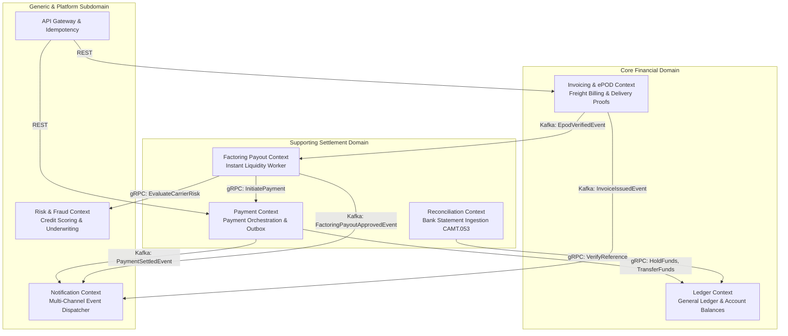

# High-Level System Architecture

## 1. System Mission and Scope
SmartPay is an enterprise-grade, event-driven financial logistics payment platform engineered for UK and European freight transport. It combines microsecond-level balance safety, automated freight pricing, and double-entry general ledger integrity.

Core Objectives:
* Cryptographic verification of freight delivery proofs (ePOD).
* Dynamic freight invoice pricing (mileage, vehicle type, fuel surcharge, VAT).
* Instant factoring liquidity with a 2.5% platform fee instead of 30-90 day payment terms.
* Zero-sum double-entry ledger ensuring complete auditability and ISO-20022 bank reconciliation.

---

## 2. Domain-Driven Design (DDD) Bounded Contexts & Context Mapping

The platform is partitioned into 7 distinct Bounded Contexts:



### Context Definitions
1. **Ledger Context (`smartpay-ledger-service`)**:
   * **Responsibility**: Maintains the immutable double-entry chart of accounts and journal entries. Manages atomic balance holds, releases, and transfers under pessimistic locking.
   * **Core Models**: `Account`, `AccountBalance`, `JournalTransaction`, `JournalEntry`.
2. **Invoicing & ePOD Context (`smartpay-invoice-service`)**:
   * **Responsibility**: Ingests and verifies delivery proofs (GPS bounds, S3 photos, SHA-256 signature hash); computes itemized freight pricing.
   * **Core Models**: `EpodRecord`, `Invoice`, `InvoicePricing`, `GeoLocation`.
3. **Payment Context (`smartpay-payment-service`)**:
   * **Responsibility**: Orchestrates payment orders, enforces two-tier distributed idempotency, and commits outbox events.
   * **Core Models**: `TransactionalOutbox`, `IdempotencyRecord`.
4. **Factoring Payout Context (`smartpay-payout-worker`)**:
   * **Responsibility**: Event-driven worker consuming delivery verification events (`EpodVerifiedEvent`) via Kafka consumer group `smartpay-factoring-workers`. Dispatches non-blocking gRPC calls via Virtual Threads to evaluate carrier credit risk and initiate instant factoring advances without multi-pod collisions.
5. **Reconciliation Context (`smartpay-recon-service`)**:
   * **Responsibility**: Parses bank CAMT.053 XML and MT940 statements, matching lines to ledger journal transactions via `end_to_end_id`.
6. **Risk & Fraud Context (`smartpay-risk-service`)**:
   * **Responsibility**: Evaluates carrier creditworthiness, enforces maximum factoring exposure limits, and computes multi-factor fraud scores via high-performance gRPC over HTTP/2.
   * **Core Models**: `CarrierRiskProfile`, `FraudRuleEvaluation`, `RiskScore`, `RiskTier`.
7. **Notification Context (`smartpay-notification-service`)**:
   * **Responsibility**: Listens asynchronously to Kafka domain events (`InvoiceIssuedEvent`, `PaymentSettledEvent`, `FactoringPayoutApprovedEvent`) and dispatches templated alerts via SMS (Twilio), Email (SendGrid), and secure signed Webhooks with consumer-side idempotency and Dead Letter Queues (DLQ).
   * **Core Models**: `NotificationLog`, `NotificationTemplate`, `NotificationChannel`.

---

## 3. Communication Protocols: Synchronous gRPC vs Asynchronous EDA

The platform employs a hybrid communication strategy:

```
┌─────────────────────────────────────────────────────────────────────────────────┐
│                             Clients (Web / Mobile)                              │
└────────────────────────────────────────┬────────────────────────────────────────┘
                                         │ HTTPS / JSON REST
┌────────────────────────────────────────▼────────────────────────────────────────┐
│                                   API Gateway                                   │
└───────────────────┬─────────────────────────────────────────────┬───────────────┘
                    │ HTTP REST                                   │ HTTP REST
┌───────────────────▼─────────────┐             ┌─────────────────▼───────────────┐
│         Invoice Service         │             │         Payment Service         │
└───────────────────┬─────────────┘             └─────────┬───────────────┬───────┘
                    │ Outbox Event                        │               │ gRPC HTTP/2
                    │ (EpodVerifiedEvent)                 │ Outbox Event  │ (HoldFunds,
                    ▼                                     │ (Payment-     │  ReleaseHold)
┌─────────────────────────────────────────────────────────┼───────┐       ▼
│              Redpanda / Kafka Event Stream              │       │ ┌─────────────┐
│       (smartpay.events.{invoice, payment, payout})      │       │ │LedgerService│
└───────────────┬─────────────────────────────────┬───────┘       │ └─────────────┘
                │ Partitioned Group               │               │
                │ smartpay-factoring-workers      │               ▼
┌───────────────▼───────────────┐                 │ (PaymentSettledEvent)
│    Payout Worker (K8s Pods)   │                 │
└───────┬───────────────┬───────┘                 │ Consumer Group:
        │               │                         │ smartpay-notification-workers
        │ gRPC HTTP/2   │ gRPC HTTP/2             ▼
        │ (EvaluateRisk)│ (InitiatePayment) ┌─────────────────────────────────────┐
        ▼               ▼                   │     Notification Service (Pods)     │
┌───────────────┐┌───────────────┐          └──────────────────┬──────────────────┘
│  Risk Service ││Payment Service│                             │ SMS / Email / Webhook
└───────────────┘└───────────────┘                             ▼
                                           ┌─────────────────────────────────────┐
                                           │  External Providers: Twilio/SendGrid│
                                           └─────────────────────────────────────┘
```

1. **Synchronous RPC (gRPC over HTTP/2)**:
   * **Usage**: Mission-critical, low-latency financial calls demanding immediate transactional consistency.
   * **`payment-service` $\to$ `ledger-service`**: Synchronous balance hold (`HoldFunds`) and debit capture (`ReleaseHold`).
   * **`payout-worker` $\to$ `risk-service`**: Synchronous carrier creditworthiness and fraud score evaluation (`EvaluateCarrierRisk`).
   * **`payout-worker` $\to$ `payment-service`**: Synchronous disbursement order placement (`InitiatePayment`).

2. **Asynchronous Event-Driven Architecture (EDA via Redpanda/Kafka)**:
   * **Usage**: High-throughput business event propagation, eventual consistency, and decoupled notification dispatch.
   * **`invoice-service`**: Emits `EpodVerifiedEvent` (triggering instant factoring) and `InvoiceIssuedEvent`.
   * **`payment-service`**: Emits `PaymentSettledEvent` once Faster Payments confirms clearance via bank rails.
   * **`payout-worker`**: Emits `FactoringPayoutApprovedEvent` upon successful liquidity advance.
   * **`notification-service`**: Consumes from `smartpay.events.*` to notify carriers, shippers, and finance teams in real time without coupling producers to communication channels.
---

## 4. Hexagonal / Clean Architecture in Microservices

Each microservice adheres to Hexagonal (Ports & Adapters) principles:

```
                  ┌────────────────────────────────────────┐
                  │          Inbound Adapters              │
                  │  REST Controller | gRPC Service Impl   │
                  │                   │                    │
                  │                   ▼                    │
                  │       Application / Port Services      │
                  │  AccountBalanceService | EpodService   │
                  │                   │                    │
                  │                   ▼                    │
                  │        Domain Model (Pure Java)        │
                  │    Money | AccountId | BalanceRecord   │
                  │                   ▲                    │
                  │                   │                    │
                  │          Outbound Adapters             │
                  │ Spring Data JPA Repositories | S3 | DB │
                  └────────────────────────────────────────┘
```

* **Domain Layer**: Grounded in `smartpay-common` value objects and records. Independent of Spring, Hibernate, or infrastructure concerns.
* **Application Layer**: Port interfaces orchestrating business rules and domain logic.
* **Infrastructure Layer**: Outbound adapters (Spring Data JPA, PostgreSQL, Flyway, gRPC client stubs).
