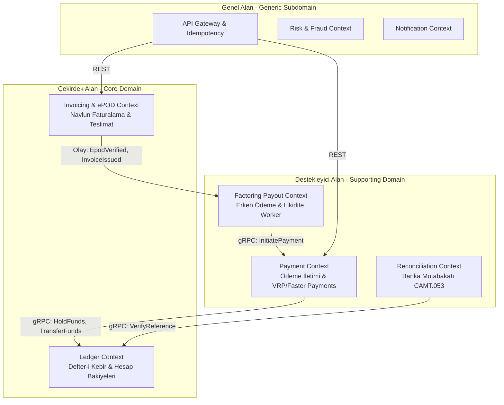

# Yüksek Seviye Sistem Mimarisi (High-Level Architecture)

## 1. Sistemin Amacı ve Kapsamı
SmartPay, İngiltere ve Avrupa navlun taşımacılığı lojistiği için tasarlanmış yüksek hacimli, düşük gecikmeli bir ödeme, çift taraflı muhasebe ve faktoring platformudur.

Temel misyonu:
* Yük teslimat kanıtlarının (ePOD) kriptografik olarak doğrulanması.
* Navlun faturalarının dinamik olarak fiyatlandırılması (mil, araç tipi, yakıt sürşarjı, KDV).
* 30-90 günlük ödeme vadeleri yerine taşımacılara %2.5 komisyonla anında erken ödeme (factoring) imkanı sunulması.
* Çift taraflı (double-entry) sıfır-toplamlı defter ile tam finansal denetim izi ve banka ekstresi mutabakatı.

---

## 2. Domain-Driven Design (DDD) Bounded Contexts & Context Mapping

Sistem 5 ana Bounded Context'e (Sınırlı Bağlam) ayrılmıştır:



### Context Tanımları
1. **Ledger Context (`smartpay-ledger-service`)**:
   * **Sorumluluk**: Platform içi tüm para hareketlerinin defter kaydını tutar. Hesap bakiyelerini atomik kilitler altında korur.
   * **Model**: `Account`, `AccountBalance`, `JournalTransaction`, `JournalEntry`.
2. **Invoicing & ePOD Context (`smartpay-invoice-service`)**:
   * **Sorumluluk**: Lojistik teslimat kanıtlarını (GPS, S3 fotoğrafı, SHA-256 imza) doğrular; navlun faturasını hesaplar.
   * **Model**: `EpodRecord`, `Invoice`, `InvoicePricing`, `GeoLocation`.
3. **Payment Context (`smartpay-payment-service`)**:
   * **Sorumluluk**: Banka ödeme emirlerinin yaşam döngüsünü, iki katmanlı idempotency yönetimini ve transactional outbox kaydını yönetir.
   * **Model**: `TransactionalOutbox`, `IdempotencyRecord`.
4. **Factoring Payout Context (`smartpay-payout-worker`)**:
   * **Sorumluluk**: Erken ödeme almaya hak kazanan onaylı faturaları periyodik olarak tarar ve ödeme emri çıkarır.
5. **Reconciliation Context (`smartpay-recon-service`)**:
   * **Sorumluluk**: Banka CAMT.053 XML / MT940 ekstrelerini içeri aktararak defter kayıtlarıyla uçtan uca eşleştirir.

---

## 3. İletişim Protokolleri: Senkron gRPC vs Asenkron EDA

Platformda iletişim iki temel modele ayrılmıştır:

```
┌─────────────────────────────────────────────────────────────┐
│                   İstemciler (Web / Mobil)                  │
└──────────────────────────────┬──────────────────────────────┘
                               │ HTTPS / JSON REST
┌──────────────────────────────▼──────────────────────────────┐
│                         API Gateway                         │
└──────────────┬───────────────────────────────┬──────────────┘
               │ HTTP REST                     │ HTTP REST
┌──────────────▼──────────────┐ ┌──────────────▼──────────────┐
│       Invoice Service       │ │       Payment Service       │
└──────────────┬──────────────┘ └──────────────┬──────────────┘
               │                               │
               │ Kafka Event                   │ Senkron gRPC over HTTP/2
               │ (EpodVerified)                │ (HoldFunds, TransferFunds)
┌──────────────▼──────────────┐ ┌──────────────▼──────────────┐
│        Payout Worker        │ │        Ledger Service       │
└──────────────┬──────────────┘ └─────────────────────────────┘
               │
               │ Senkron gRPC over HTTP/2
               │ (InitiatePayment)
┌──────────────▼──────────────┐
│       Payment Service       │
└─────────────────────────────┘
```

1. **Senkron Ağ İletişimi (gRPC over HTTP/2)**:
   * **Nerede kullanılır?**: Kritik finansal operasyonlarda tutarlılık (Consistency) gerektiğinde.
   * **Örnek**: `payment-service` bir ödeme çıkarmadan önce `ledger-service`'e senkron olarak `HoldFunds` çağrısı yapmak zorundadır; bakiye bloke edilmeden ödeme başlatılamaz.
2. **Asenkron Olay Odaklı Mimari (EDA over Kafka)**:
   * **Nerede kullanılır?**: Servisler arası gevşek bağlılık (Loose Coupling) ve nihai tutarlılık (Eventual Consistency) yeterli olduğunda.
   * **Örnek**: Bir fatura kesildiğinde (`InvoiceIssuedEvent`), bu olay Kafka'ya atılır. `notification-service` müşteriye e-posta gönderir; faturanın kesilmesi e-postanın gitmesine senkron olarak bağımlı değildir.

---

## 4. Hekzagonal / Temiz Mimari (Hexagonal / Clean Architecture)

Her mikroservis içerisinde hekzagonal mimari prensipleri uygulanır:

```
                  ┌────────────────────────────────────────┐
                  │          Adapters (Inbound)            │
                  │  REST Controller | gRPC Service Impl   │
                  │                   │                    │
                  │                   ▼                    │
                  │       Application / Port Services      │
                  │  AccountBalanceService | EpodService   │
                  │                   │                    │
                  │                   ▼                    │
                  │        Domain Model (Pure POJO)        │
                  │    Money | AccountId | BalanceRecord   │
                  │                   ▲                    │
                  │                   │                    │
                  │          Adapters (Outbound)           │
                  │ Spring Data JPA Repositories | S3 | DB │
                  └────────────────────────────────────────┘
```

* **Domain Katmanı**: `smartpay-common` modellerine dayanır, hiçbir Spring Framework veya veritabanı kütüphanesine bağımlı değildir.
* **Uygulama Katmanı**: Use-case'leri ve domain mantığını yöneten servis arayüzleri.
* **Altyapı (Infrastructure) Katmanı**: Spring Data JPA, PostgreSQL dialect, Flyway, gRPC Stub adapter'ları.
