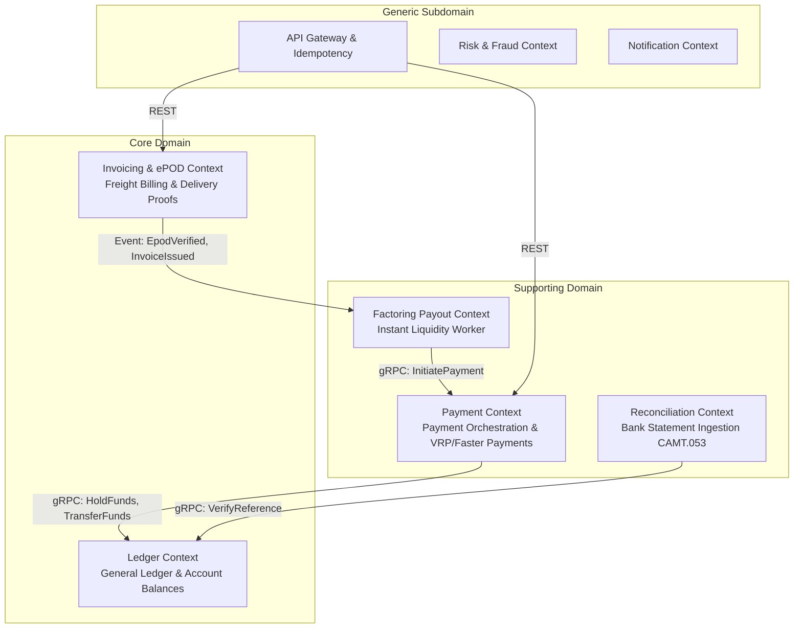

# High-Level System Architecture

## 1. System Mission and Scope
SmartPay is an enterprise-grade, event-driven financial logistics payment platform engineered for UK and European freight transport. It combines microsecond-level balance safety, automated freight pricing, and double-entry general ledger integrity.

Core Objectives:
* Cryptographic verification of freight delivery proofs (ePOD).
* Dynamic freight invoice pricing (mileage, vehicle type, fuel surcharge, VAT).
* Instant factoring liquidity with a 2.5% platform fee instead of 30-90 day payment terms.
* Zero-sum double-entry ledger ensuring complete auditability and ISO-20022 bank reconciliation.

---

## 2. Domain-Driven Design (DDD) Bounded Contexts & Context Mapping

The platform is partitioned into 5 primary Bounded Contexts:



### Context Definitions
1. **Ledger Context (`smartpay-ledger-service`)**:
   * **Responsibility**: Maintains the immutable double-entry chart of accounts and journal entries. Manages atomic balance holds, releases, and transfers under pessimistic locking.
   * **Core Models**: `Account`, `AccountBalance`, `JournalTransaction`, `JournalEntry`.
2. **Invoicing & ePOD Context (`smartpay-invoice-service`)**:
   * **Responsibility**: Ingests and verifies delivery proofs (GPS bounds, S3 photos, SHA-256 signature hash); computes itemized freight pricing.
   * **Core Models**: `EpodRecord`, `Invoice`, `InvoicePricing`, `GeoLocation`.
3. **Payment Context (`smartpay-payment-service`)**:
   * **Responsibility**: Orchestrates payment orders, enforces two-tier distributed idempotency, and commits outbox events.
   * **Core Models**: `TransactionalOutbox`, `IdempotencyRecord`.
4. **Factoring Payout Context (`smartpay-payout-worker`)**:
   * **Responsibility**: Continuously polls approved freight invoices via Virtual Threads and triggers immediate carrier disbursements.
5. **Reconciliation Context (`smartpay-recon-service`)**:
   * **Responsibility**: Parses bank CAMT.053 XML and MT940 statements, matching lines to ledger journal transactions via `end_to_end_id`.

---

## 3. Communication Protocols: Synchronous gRPC vs Asynchronous EDA

The platform employs a hybrid communication strategy:

```
┌─────────────────────────────────────────────────────────────┐
│                    Clients (Web / Mobile)                   │
└──────────────────────────────┬──────────────────────────────┘
                               │ HTTPS / JSON REST
┌──────────────────────────────▼──────────────────────────────┐
│                         API Gateway                         │
└──────────────┬───────────────────────────────┬──────────────┘
               │ HTTP REST                     │ HTTP REST
┌──────────────▼──────────────┐ ┌──────────────▼──────────────┐
│       Invoice Service       │ │       Payment Service       │
└──────────────┬──────────────┘ └──────────────┬──────────────┘
               │                               │
               │ Kafka Event                   │ Synchronous gRPC over HTTP/2
               │ (EpodVerified)                │ (HoldFunds, TransferFunds)
┌──────────────▼──────────────┐ ┌──────────────▼──────────────┐
│        Payout Worker        │ │        Ledger Service       │
└──────────────┬──────────────┘ └─────────────────────────────┘
               │
               │ Synchronous gRPC over HTTP/2
               │ (InitiatePayment)
┌──────────────▼──────────────┐
│       Payment Service       │
└─────────────────────────────┘
```

1. **Synchronous RPC (gRPC over HTTP/2)**:
   * **Usage**: Mission-critical operations demanding immediate consistency.
   * **Example**: Before issuing an external disbursement, `payment-service` synchronously calls `HoldFunds` on `ledger-service`. Payment execution cannot proceed without confirmed hold reservation.
2. **Asynchronous Event-Driven Architecture (EDA via Redpanda/Kafka)**:
   * **Usage**: Inter-service notifications and eventual consistency.
   * **Example**: When an invoice is finalized (`InvoiceIssuedEvent`), it is published to Kafka. Downstream services (such as notification dispatchers) consume it asynchronously without coupling to the invoice service.

---

## 4. Hexagonal / Clean Architecture in Microservices

Each microservice adheres to Hexagonal (Ports & Adapters) principles:

```
                  ┌────────────────────────────────────────┐
                  │          Inbound Adapters              │
                  │  REST Controller | gRPC Service Impl   │
                  │                   │                    │
                  │                   ▼                    │
                  │       Application / Port Services      │
                  │  AccountBalanceService | EpodService   │
                  │                   │                    │
                  │                   ▼                    │
                  │        Domain Model (Pure Java)        │
                  │    Money | AccountId | BalanceRecord   │
                  │                   ▲                    │
                  │                   │                    │
                  │          Outbound Adapters             │
                  │ Spring Data JPA Repositories | S3 | DB │
                  └────────────────────────────────────────┘
```

* **Domain Layer**: Grounded in `smartpay-common` value objects and records. Independent of Spring, Hibernate, or infrastructure concerns.
* **Application Layer**: Port interfaces orchestrating business rules and domain logic.
* **Infrastructure Layer**: Outbound adapters (Spring Data JPA, PostgreSQL, Flyway, gRPC client stubs).
