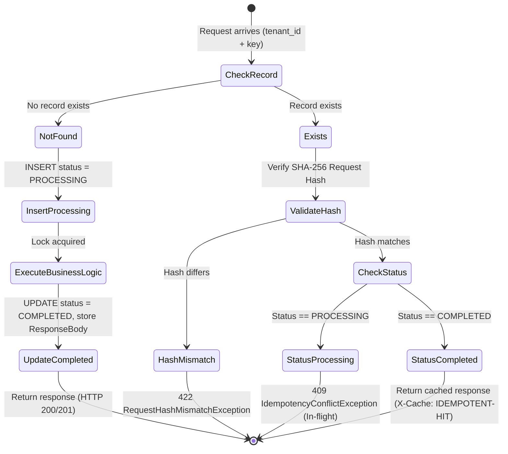

# Low-Level Design & Concurrency Algorithms

This document describes the low-level concurrency mechanisms, database locking algorithms, and distributed consistency patterns in SmartPay.

---

## 1. Concurrency Control & Database Locking Models

In financial ledger systems, two critical concurrency anomalies must be addressed:
* **Race Conditions (Double-Spending)**: Simultaneous debit requests causing balances to breach zero.
* **Deadlocks**: Concurrent transfers between accounts (e.g. Account A to Account B, and Account B to Account A) holding and waiting on competing row locks.

### A) Pessimistic Locking (`SELECT ... FOR UPDATE`)
Balance deductions, funds transfers, and hold reservations acquire a `PESSIMISTIC_WRITE` lock:
```sql
SELECT * FROM account_balances 
WHERE account_id = :accountId 
FOR UPDATE;
```
This blocks competing transactions on the same account row until the locking transaction commits or rolls back.

### B) Deadlock-Free Ordered Locking Algorithm
When transferring funds between two accounts, locks are always acquired in strictly ascending order of their `AccountId`:

```java
// AccountBalanceServiceImpl.java
public void transfer(AccountId source, AccountId target, Money amount) {
    AccountId firstLock = source.compareTo(target) < 0 ? source : target;
    AccountId secondLock = source.compareTo(target) < 0 ? target : source;

    // Both threads acquire locks in the identical order -> Cyclic deadlocks are mathematically impossible!
    AccountBalanceEntity b1 = balanceRepo.findByAccountIdWithLock(firstLock.value()).orElseThrow();
    AccountBalanceEntity b2 = balanceRepo.findByAccountIdWithLock(secondLock.value()).orElseThrow();
    
    // ... Balance assertions and atomic deduction ...
}
```

### C) Optimistic Locking (`@Version`)
Read-mostly paths utilize the `account_balances.version` column to detect stale updates without database-level write locks.

---

## 2. Double-Entry Zero-Sum Ledger Mechanics

Every financial movement consists of a header transaction (`journal_transactions`) and paired debit/credit lines (`journal_entries`).

```
                    ┌─────────────────────────────────┐
                    │    journal_transactions         │
                    │ id: TX-1001                     │
                    │ reference: FACTORING_PAYOUT     │
                    │ status: POSTED                  │
                    └────────────────┬────────────────┘
                                     │
           ┌─────────────────────────┴─────────────────────────┐
           ▼                                                   ▼
┌─────────────────────────────────┐ ┌─────────────────────────────────┐
│ journal_entries                 │ │ journal_entries                 │
│ account: PLATFORM_ESCROW        │ │ account: CARRIER_MAIN_ACCOUNT   │
│ type: DEBIT                     │ │ type: CREDIT                    │
│ amount: 975.00 GBP              │ │ amount: 975.00 GBP              │
└─────────────────────────────────┘ └─────────────────────────────────┘
```

### Zero-Sum Validation Invariant:
```java
Money totalDebit = entries.stream()
        .filter(e -> e.entryType() == EntryType.DEBIT)
        .map(JournalEntryLine::amount)
        .reduce(Money.zero(currency), Money::plus);

Money totalCredit = entries.stream()
        .filter(e -> e.entryType() == EntryType.CREDIT)
        .map(JournalEntryLine::amount)
        .reduce(Money.zero(currency), Money::plus);

if (!totalDebit.equals(totalCredit)) {
    throw new UnbalancedJournalTransactionException(totalDebit, totalCredit);
}
```

---

## 3. Two-Tier Distributed Idempotency Mechanism

To prevent duplicate disbursements upon network retries, an SHA-256 fingerprinting state machine is enforced:



---

## 4. Transactional Outbox Pattern with `SKIP LOCKED` Polling

To guarantee At-Least-Once Kafka event delivery without distributed 2PC transactions, outbox rows are committed in the same database transaction as domain state:

```sql
-- High-throughput, non-blocking polling across concurrent worker instances:
SELECT * FROM transactional_outbox
WHERE processed_at IS NULL
ORDER BY created_at ASC
LIMIT 50
FOR UPDATE SKIP LOCKED;
```

* **`FOR UPDATE SKIP LOCKED`**: Bypasses rows currently held by other workers and locks the next unlocked batch with zero wait time.
* Once delivered to Kafka:
  ```sql
  UPDATE transactional_outbox SET processed_at = CURRENT_TIMESTAMP WHERE id IN (:ids);
  ```

---

## 5. Bank Statement Auto-Reconciliation Algorithm (CAMT.053)

Incoming bank statement lines from ClearBank or Barclays are reconciled against ledger records using the matching pipeline:

```
Bank Statement Line:
- EndToEndId: "E2E-LOAD-841-PAYOUT"
- Amount: 97500 pence (975.00 GBP)
- Type: DEBIT (Outflow from platform bank account)

       │
       ▼ Search Index: journal_transactions.idempotency_key == EndToEndId
       │
Ledger Transaction Match:
- IdempotencyKey: "E2E-LOAD-841-PAYOUT"
- ReferenceType: "FACTORING_PAYOUT"
- Entries:
    - Escrow Account: DEBIT 975.00 GBP
    - Carrier Account: CREDIT 975.00 GBP

       │
       ▼ Invariant Checks:
       - Amount matches? (975.00 == 975.00) -> YES
       - Currency matches? (GBP == GBP) -> YES
       - Direction matches? (Bank DEBIT == Ledger Escrow DEBIT) -> YES

Result: bank_statement_lines.reconciliation_status = 'MATCHED'
        bank_statement_lines.matched_entry_id = <entry_uuid>
```
