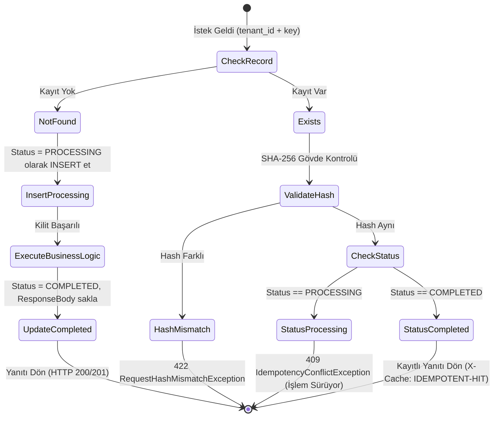

# Düşük Seviye Mimari ve Tasarım (Low-Level Architecture)

Bu doküman, SmartPay platformundaki kritik algoritmaları, veritabanı kilit mekanizmalarını ve dağıtık sistem kalıplarını derinlemesine açıklar.

---

## 1. Eşzamanlılık ve Kilit Stratejileri (Concurrency & Locking)

Finansal hesap bakiyelerinde iki temel risk vardır:
* **Race Condition (Çift Harcama / Double-Spending)**: Kullanıcının aynı anda iki istek göndererek bakiyesini eksiye düşürmesi.
* **Deadlock (Karşılıklı Kilitlenme)**: A hesabından B hesabına ve B hesabından A hesabına aynı anda transfer yapılırken veritabanı kilitlerinin birbirini beklemesi.

### A) Pessimistic Locking (`SELECT ... FOR UPDATE`)
Bakiye düşümü, para transferi ve bloke koyma gibi kritik işlemlerde `PESSIMISTIC_WRITE` kilidi kullanılır:
```sql
SELECT * FROM account_balances 
WHERE account_id = :accountId 
FOR UPDATE;
```
Bu kilit, transaction tamamlanana kadar diğer thread'lerin o satırı okuyup değiştirmesini engeller.

### B) Deadlock Önleme Algoritması (Ordered Locking)
İki hesap arasında transfer yapılırken kilitler daima hesap ID'lerinin doğal sıralamasına (lexicographical order) göre alınır:

```java
// AccountBalanceServiceImpl.java
public void transfer(AccountId source, AccountId target, Money amount) {
    AccountId firstLock = source.compareTo(target) < 0 ? source : target;
    AccountId secondLock = source.compareTo(target) < 0 ? target : source;

    // Kilitler daima aynı alfabetik sırada alınır -> Deadlock imkansızlaşır!
    AccountBalanceEntity b1 = balanceRepo.findByAccountIdWithLock(firstLock.value()).orElseThrow();
    AccountBalanceEntity b2 = balanceRepo.findByAccountIdWithLock(secondLock.value()).orElseThrow();
    
    // ... Bakiye kontrolleri ve güncelleme ...
}
```

### C) Optimistic Locking (`@Version`)
Sadece bakiye sorgulayan veya düşük çakışmalı okuma yapan servisler için `account_balances.version` kolonu ile optimistik kilitleme sağlanır.

---

## 2. Çift Taraflı Muhasebe (Double-Entry Zero-Sum) Algoritması

Sistemdeki her para hareketi bağımsız bir `journal_transaction` ve buna bağlı `journal_entries` satırlarından oluşur.

```
                    ┌─────────────────────────────────┐
                    │    journal_transactions         │
                    │ id: TX-1001                     │
                    │ reference: FACTORING_PAYOUT     │
                    │ status: POSTED                  │
                    └────────────────┬────────────────┘
                                     │
           ┌─────────────────────────┴─────────────────────────┐
           ▼                                                   ▼
┌─────────────────────────────────┐ ┌─────────────────────────────────┐
│ journal_entries                 │ │ journal_entries                 │
│ account: PLATFORM_ESCROW        │ │ account: CARRIER_MAIN_ACCOUNT   │
│ type: DEBIT                     │ │ type: CREDIT                    │
│ amount: 975.00 GBP              │ │ amount: 975.00 GBP              │
└─────────────────────────────────┘ └─────────────────────────────────┘
```

### Değişmez Doğrulama Kuralı:
```java
Money totalDebit = entries.stream()
        .filter(e -> e.entryType() == EntryType.DEBIT)
        .map(JournalEntryLine::amount)
        .reduce(Money.zero(currency), Money::plus);

Money totalCredit = entries.stream()
        .filter(e -> e.entryType() == EntryType.CREDIT)
        .map(JournalEntryLine::amount)
        .reduce(Money.zero(currency), Money::plus);

if (!totalDebit.equals(totalCredit)) {
    throw new UnbalancedJournalTransactionException(totalDebit, totalCredit);
}
```

---

## 3. İki Katmanlı Dağıtık Idempotency (Two-Tier Idempotency)

Ağ kesintilerinde mükerrer ödemeleri önlemek için SHA-256 tabanlı iki aşamalı durum makinesi kullanılır:



---

## 4. Transactional Outbox & `SKIP LOCKED` Polling

Mikroservis veritabanına kayıt atarken aynı transaction içinde `transactional_outbox` tablosuna event yazar. Arka plan işçisi bu tabloyu yüksek performansla tarar:

```sql
-- Birden fazla worker aynı anda çalıştığında çakışmayı önleyen O(1) polling sorgusu:
SELECT * FROM transactional_outbox
WHERE processed_at IS NULL
ORDER BY created_at ASC
LIMIT 50
FOR UPDATE SKIP LOCKED;
```

* **`FOR UPDATE SKIP LOCKED`**: Başka bir sanal thread veya worker instance'ı tarafından o an işlenmekte olan satırları atlar, sıradaki ilk boş 50 satırı anında kilitler. Kilit bekleme süresi $0\text{ ms}$'dir.
* Kafka'ya mesaj başarıyla iletildikten sonra:
  ```sql
  UPDATE transactional_outbox SET processed_at = CURRENT_TIMESTAMP WHERE id IN (:ids);
  ```

---

## 5. Banka Ekstresi Otomatik Mutabakat Motoru (CAMT.053 Matching)

ClearBank veya Barclays'ten gelen ISO-20022 XML ekstrelerindeki satırlar aşağıdaki algoritmayla eşleştirilir:

```
Bank Statement Line:
- EndToEndId: "E2E-LOAD-841-PAYOUT"
- Amount: 97500 pence (975.00 GBP)
- Type: DEBIT (Banka çıkışı)

       │
       ▼ Arama Algoritması: journal_transactions.idempotency_key == EndToEndId
       │
Ledger Transaction Match:
- IdempotencyKey: "E2E-LOAD-841-PAYOUT"
- ReferenceType: "FACTORING_PAYOUT"
- Entries:
    - Escrow Account: DEBIT 975.00 GBP
    - Carrier Account: CREDIT 975.00 GBP

       │
       ▼ Doğrulama:
       - Tutar Eşit mi? (975.00 == 975.00) -> EVET
       - Para Birimi Eşit mi? (GBP == GBP) -> EVET
       - Yön Uyumlu mu? (Bank DEBIT == Ledger Escrow DEBIT) -> EVET

Sonuç: bank_statement_lines.reconciliation_status = 'MATCHED'
       bank_statement_lines.matched_entry_id = <entry_uuid>
```
