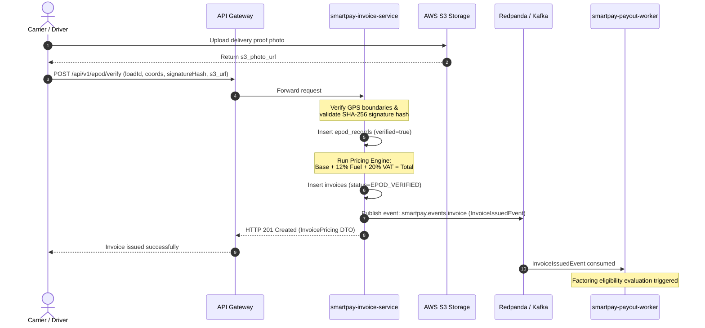
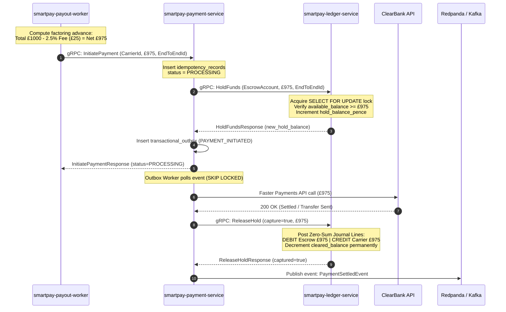
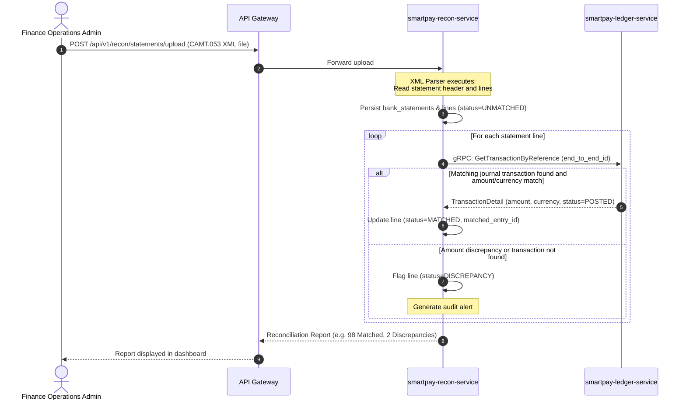

# Sequence Diagrams

This document details the chronological interaction flow across microservices, databases, and external payment rails for core business workflows.

---

## 1. Electronic Proof of Delivery (ePOD) Verification & Invoice Issuance Flow

Traces the path from driver delivery completion to automated invoice generation:

---

## 2. Instant Factoring Payout & Double-Entry Ledger Posting Flow

Traces invoice advance disbursement, balance hold reservation, and two-tier ledger settlement:

---

## 3. Bank Statement (CAMT.053) Ingestion & Auto-Reconciliation Flow

Traces bank statement line parsing and matching against ledger journal transactions:

