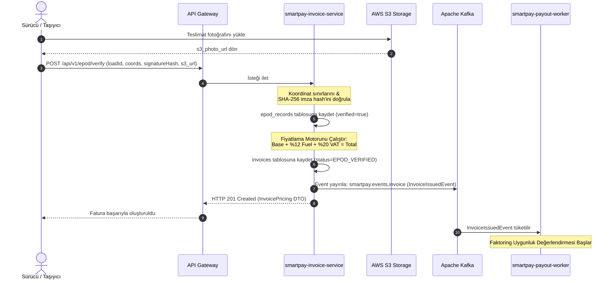
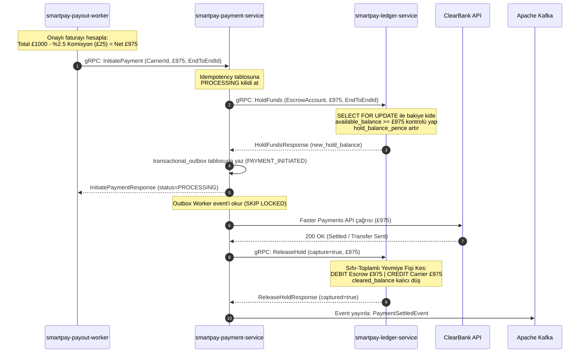
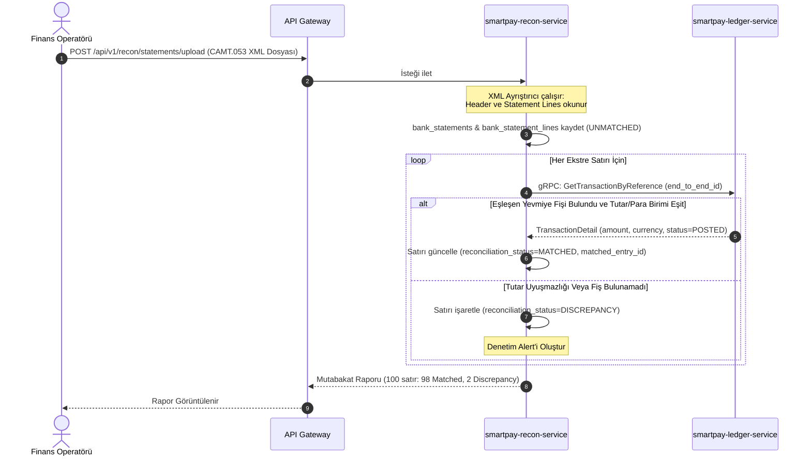

# Sıralama Diyagramları (Sequence Diagrams)

Bu doküman, SmartPay platformundaki uçtan uca kritik iş akışlarının servisler ve veritabanları arasındaki etkileşim sıralamasını gösterir.

---

## 1. Teslimat Kanıtı (ePOD) Doğrulama ve Fatura Üretimi Akışı

Sürücünün teslimatı tamamlamasından faturanın otomatik kesilmesine kadar olan süreç:

---

## 2. Erken Ödeme (Factoring Payout) & Ledger Çift Taraflı Kayıt Akışı

Faturanın erken ödenmesi için `payout-worker`'ın `payment-service` ve `ledger-service` ile olan etkileşimi:

---

## 3. Banka Ekstresi (CAMT.053) İçe Aktarma & Otomatik Mutabakat Akışı

Bankadan gelen ekstre satırlarının defter yevmiye kayıtlarıyla eşleştirilmesi:

