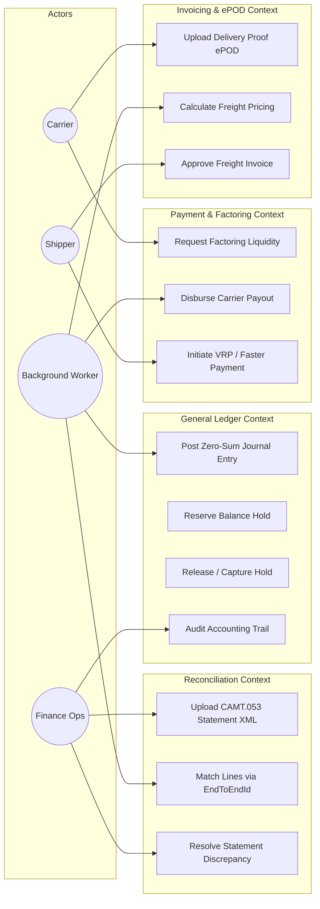

# Use Case Diagrams

This document visualizes the primary interactions between external actors and the SmartPay Logistics Payment Platform.

---

## 1. Primary Actors

* 🏢 **Shipper (Freight Customer)**: Creates freight transport orders, reviews itemized invoices, deposits funds into escrow, and approves final settlements.
* 🚚 **Carrier / Driver**: Transports loads, uploads Electronic Proof of Delivery (ePOD) with GPS coordinates and cryptographic signatures, and requests instant factoring liquidity.
* 👔 **Finance Operations Administrator**: Monitors double-entry ledger health, uploads ISO-20022 bank statements, investigates discrepancies, and reconciles statements.
* 🤖 **System Background Workers**: Automated workers handling transactional outbox event publishing, factoring eligibility polling, and scheduled reconciliation.
* 🏦 **Banking & Payment Rails**: External clearing systems including Faster Payments, Open Banking Variable Recurring Payments (VRP), and ClearBank/Barclays partner APIs.

---

## 2. Platform Use Case Map

---

## 3. Detailed Use Case Specifications

### A) Carrier Scenarios
1. **Upload Delivery Proof (ePOD)**:
   * Sürücü captures delivery photo, collects recipient signature, and submits `latitude`, `longitude`, `signature_hash`, and S3 photo link via mobile client.
2. **Request Instant Factoring Liquidity**:
   * Upon delivery verification, carrier bypasses standard 30-90 day net payment terms and requests instant disbursement with a 2.5% platform fee deduction.

### B) Shipper Scenarios
1. **Approve Freight Invoice**:
   * Shipper reviews the itemized invoice (base rate, fuel surcharge, VAT) calculated from mileage and vehicle type, authorizing payment from escrow.
2. **Initiate Open Banking VRP**:
   * Shipper funds platform accounts or pays freight bills directly via Variable Recurring Payments (VRP) to avoid merchant card interchange fees.

### C) Finance Operations Scenarios
1. **Upload Bank Statement (CAMT.053 / MT940)**:
   * Administrator uploads daily bank statement XML files retrieved from clearing banks.
2. **Resolve Reconciliation Discrepancies**:
   * Lines failing automated matching (due to fee deductions or mismatched references) are inspected and cleared with manual adjustment entries.

### D) Background Worker Scenarios
1. **Transactional Outbox Publisher**:
   * Continuously polls `transactional_outbox` rows with `SKIP LOCKED` and streams events into Redpanda/Kafka topics with at-least-once delivery guarantees.
2. **Factoring Payout Scheduler**:
   * Uses Virtual Threads to evaluate approved factoring invoices, verify fraud scores with Risk Service, and trigger immediate payment via Payment gRPC API.
