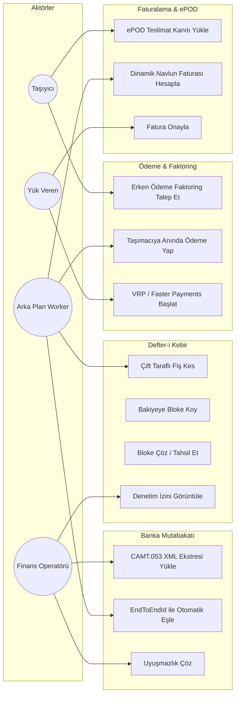

# Kullanım Senaryosu Diyagramları (Use Case Diagrams)

Bu doküman, SmartPay platformundaki farklı aktörlerin sistemle gerçekleştirdiği kullanım senaryolarını görselleştirir.

---

## 1. Aktörler (Actors)

* 🏢 **Yük Veren (Shipper)**: Yük ilanı veren, navlun sözleşmesi yapan ve faturaları ödeyen kurumsal lojistik müşterisi.
* 🚚 **Taşıyıcı / Nakliyeci (Carrier)**: Navlunu taşıyan, teslimat kanıtı (ePOD) sunan ve erken ödeme (Factoring) talep eden aktör.
* 👔 **Finans Operatörü (Financial Operations Admin)**: Platform bakiyelerini, mutabakat farklarını ve muhasebe denetimini yöneten yetkili.
* 🤖 **Otomatik Sistem / Arka Plan İşçisi (Automated Workers)**: Outbox publisher, faktoring scheduler ve periyodik mutabakat botları.
* 🏦 **Banka & Ödeme Takas Rayları (Banking Rails)**: Faster Payments, Open Banking VRP ve ClearBank/Barclays sistemleri.

---

## 2. Kullanım Senaryoları Şeması

---

## 3. Detaylı Senaryo Açıklamaları

### A) Taşıyıcı Senaryoları (Carrier Use Cases)
1. **ePOD Teslimat Kanıtı Yükle**:
   * Sürücü teslimat adresinde yükün fotoğrafını çeker, müşteri imzasını alır ve mobil uygulama üzerinden `latitude`, `longitude`, `signature_hash` ve fotoğrafı gönderir.
2. **Erken Ödeme (Factoring) Talep Et**:
   * Teslimat onaylandığında faturanın vadesini (30-90 gün) beklemek istemeyen taşımacı, tek tuşla %2.5 platform komisyonu karşılığında erken ödeme talep eder.

### B) Yük Veren Senaryoları (Shipper Use Cases)
1. **Navlun Faturasını Onayla**:
   * Yük veren, mesafeye ve araç tipine göre otomatik hesaplanmış faturayı görüntüler, onaylar ve platform emanet (escrow) hesabına para yatırır.
2. **Open Banking VRP ile Ödeme Yap**:
   * Yük veren, banka kartı komisyonlarından kaçınmak için Variable Recurring Payment (VRP) ile doğrudan banka hesabından transfer başlatır.

### C) Finans Operatörü Senaryoları (FinOps Use Cases)
1. **Banka Ekstresi (CAMT.053 / MT940) Yükle**:
   * Bankadan periyodik indirilen ISO-20022 XML ekstreleri sisteme yüklenir.
2. **Uyuşmazlıkları Çöz (Discrepancy Resolution)**:
   * Banka komisyonu veya hesap numarası uyumsuzluğu nedeniyle otomatik eşleşmeyen satırlar manuel olarak incelenir ve düzeltme fişi kesilir.

### D) Arka Plan İşçisi Senaryoları (System Worker Use Cases)
1. **Outbox Event Publisher**:
   * `transactional_outbox` tablosundaki işlenmemiş kayıtları `SKIP LOCKED` ile çekip Kafka'ya güvenle basar.
2. **Factoring Payout Scheduler**:
   * Onaylanan faktoring taleplerini sanal thread'ler (Virtual Threads) ile işleyip `payment-service`'e gRPC üzerinden anında transfer emri gönderir.
