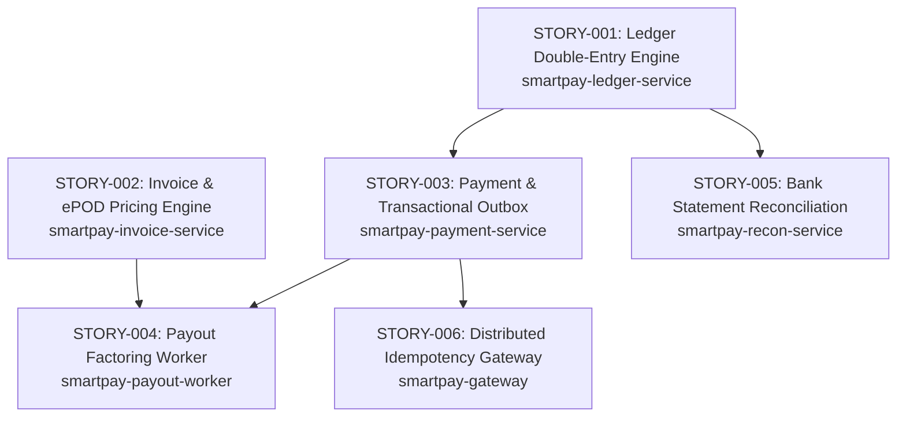

# SmartPay Platform Developer Story Cards

This directory contains detailed, production-ready developer story cards for building the SmartPay Logistics Payment Platform step-by-step.

---

## 🗺️ Story Map & Dependency Graph

---

## 📚 Story Index

| No | Title | Module | Priority | Summary |
| :--- | :--- | :--- | :--- | :--- |
| **STORY-001** | [Double-Entry Ledger & Atomic Transfer Engine](STORY-001-ledger-double-entry-engine.md) | `smartpay-ledger-service` | P0 | Zero-sum journal posting, pessimistic balance locking, hold/release lifecycle, Ledger gRPC API. |
| **STORY-002** | [Freight Invoicing & ePOD Pricing Engine](STORY-002-invoice-epod-pricing-engine.md) | `smartpay-invoice-service` | P1 | Delivery proof (ePOD) signature verification, automated freight pricing (base + fuel + VAT), multi-currency invoices. |
| **STORY-003** | [Payment Initiation & Transactional Outbox](STORY-003-payment-initiation-outbox.md) | `smartpay-payment-service` | P1 | Two-tier idempotency, Ledger gRPC hold reservation, `SKIP LOCKED` outbox event persistence. |
| **STORY-004** | [Carrier Factoring & Instant Payout Worker](STORY-004-payout-factoring-worker.md) | `smartpay-payout-worker` | P1 | Virtual Thread worker polling approved invoices, applying 2.5% factoring fee, and executing instant payouts. |
| **STORY-005** | [Bank Statement & Auto-Reconciliation Engine](STORY-005-bank-reconciliation-engine.md) | `smartpay-recon-service` | P2 | Ingesting CAMT.053 XML / MT940 statements, auto-matching lines via `end_to_end_id` against ledger journal entries. |
| **STORY-006** | [API Gateway & Distributed Idempotency Filter](STORY-006-api-gateway-idempotency.md) | `smartpay-gateway` | P2 | SHA-256 request fingerprinting, two-tier locking, response caching, reverse proxy routing. |

---

## 🛠️ Core Engineering Guidelines
1. **Always Use `smartpay-common`**:
   * Monetary amounts must use `Money`.
   * Identifiers must use `AccountId`, `InvoiceId`, `TransactionId`, etc.
   * Domain errors must extend `SmartpayDomainException`.
2. **Synchronous Inter-Service Calls**:
   * Use gRPC client stubs generated from `smartpay-proto`. Refer to the [gRPC Technical Guide](../architecture/grpc-technical-guide.md).
3. **Virtual Threads Safety**:
   * Avoid `synchronized` methods to prevent carrier thread pinning (favor `ReentrantLock` or immutable records).
   * Utilize `Executors.newVirtualThreadPerTaskExecutor()` for concurrent task pools.
