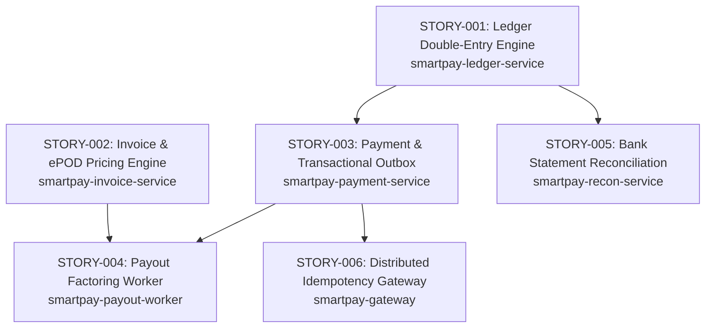

# SmartPay Platform Geliştirme Hikayeleri (Story Cards)

Bu dizin, SmartPay Lojistik Ödeme ve Fintek Platformu'nun uçtan uca implementasyonu için hazırlanmış detaylı geliştirme kartlarını içerir.

---

## 🗺️ Hikaye Haritası ve Bağımlılık Ağacı

---

## 📚 Hikaye Listesi

| No | Başlık | Modül | Öncelik | Özet |
| :--- | :--- | :--- | :--- | :--- |
| **STORY-001** | [Double-Entry Ledger & Atomik Transfer Motoru](STORY-001-ledger-double-entry-engine.md) | `smartpay-ledger-service` | P0 | Sıfır toplamlı yevmiye fişi, pessimistic lock ile bakiye transferi, hold/release mekanizması, Ledger gRPC API. |
| **STORY-002** | [Navlun Faturası & ePOD Fiyatlandırma Motoru](STORY-002-invoice-epod-pricing-engine.md) | `smartpay-invoice-service` | P1 | Teslimat kanıtı (ePOD) imza doğrulama, dinamik navlun hesaplama (baz + yakıt + KDV), fatura yaşam döngüsü. |
| **STORY-003** | [Ödeme Başlatma & Transactional Outbox](STORY-003-payment-initiation-outbox.md) | `smartpay-payment-service` | P1 | Çift katmanlı idempotency, Ledger gRPC entegrasyonu ile bloke koyma, `SKIP LOCKED` destekli Outbox event kaydı. |
| **STORY-004** | [Taşımacı Faktoring & Erken Ödeme Worker'ı](STORY-004-payout-factoring-worker.md) | `smartpay-payout-worker` | P1 | Sanal thread (Virtual Thread) worker ile onaylanan faturaları tarama, faktoring komisyon kesintisi ve anında ödeme emri. |
| **STORY-005** | [Banka Ekstresi & Otomatik Mutabakat Motoru](STORY-005-bank-reconciliation-engine.md) | `smartpay-recon-service` | P2 | ISO-20022 CAMT.053 XML / MT940 ekstre ayrıştırma, `end_to_end_id` ile defter kayıtlarına otomatik eşleştirme. |
| **STORY-006** | [API Gateway & Dağıtık Idempotency Filtresi](STORY-006-api-gateway-idempotency.md) | `smartpay-gateway` | P2 | SHA-256 request fingerprinting, iki katmanlı kilit mekanizması, ters proxy yönlendirme. |

---

## 🛠️ Temel Geliştirici Kuralları
1. **`smartpay-common` Kullanımı**: Para birimi için daima `Money`, kimlikler için `AccountId`, `InvoiceId` vb., istisnalar için `SmartpayDomainException` hiyerarşisi kullanılmalıdır.
2. **gRPC İletişimi**: Servisler arası senkron çağrılarda REST yerine `smartpay-proto` stubs kullanılmalıdır. Detaylar için [gRPC Teknik Rehberi](../architecture/grpc-technical-guide.md)'ne bakınız.
3. **Virtual Threads Güvenliği**: Uzun süren I/O işlemlerinde veya thread havuzlarında `Executors.newVirtualThreadPerTaskExecutor()` tercih edilmeli, `synchronized` metodlardan kaçınılmalıdır.
