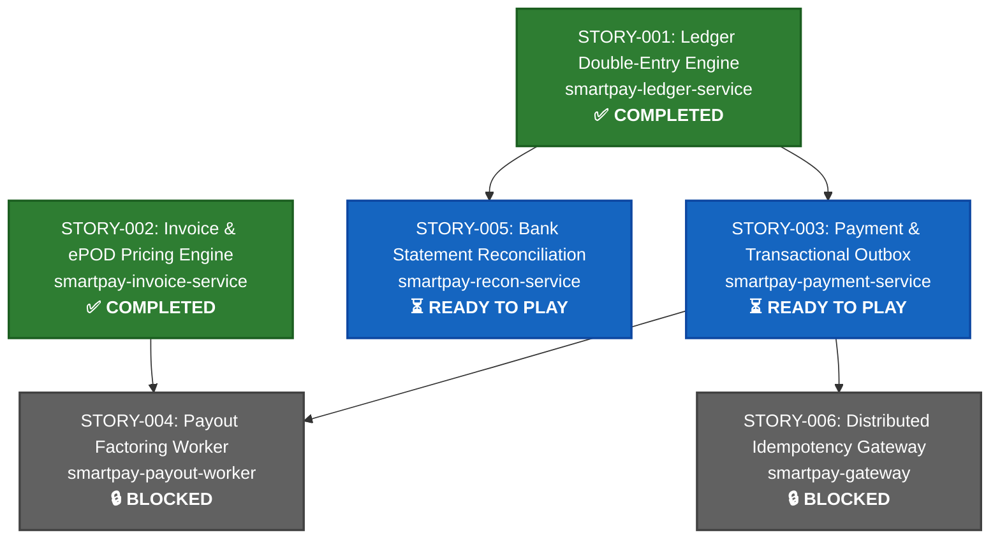

# SmartPay Platform Developer Story Cards

This directory contains detailed, production-ready developer story cards for building the SmartPay Logistics Payment Platform step-by-step.

---

## 🗺️ Story Map & Dependency Graph



---

## 📚 Story Index

| No | Title | Module | Priority | Status | Summary |
| :--- | :--- | :--- | :--- | :--- | :--- |
| **STORY-001** | [Double-Entry Ledger & Atomic Transfer Engine](STORY-001-ledger-double-entry-engine.md) | `smartpay-ledger-service` | P0 | ✅ **Completed** | Zero-sum journal posting, pessimistic balance locking, hold/release lifecycle, Ledger gRPC API on Virtual Threads. |
| **STORY-002** | [Freight Invoicing & ePOD Pricing Engine](STORY-002-invoice-epod-pricing-engine.md) | `smartpay-invoice-service` | P1 | ✅ **Completed** | Delivery proof (ePOD) cryptographic verification, automated freight pricing (base + fuel + VAT), multi-currency invoices. |
| **STORY-003** | [Payment Initiation & Transactional Outbox](STORY-003-payment-initiation-outbox.md) | `smartpay-payment-service` | P1 | ⏳ **Ready to Play** | Two-tier idempotency, Ledger gRPC hold reservation, `SKIP LOCKED` transactional outbox event persistence. |
| **STORY-004** | [Carrier Factoring & Instant Payout Worker](STORY-004-payout-factoring-worker.md) | `smartpay-payout-worker` | P1 | 🔒 **Blocked** | Virtual Thread worker polling approved invoices, applying 2.5% factoring fee, and executing instant payouts. |
| **STORY-005** | [Bank Statement & Auto-Reconciliation Engine](STORY-005-bank-reconciliation-engine.md) | `smartpay-recon-service` | P2 | ⏳ **Ready to Play** | Ingesting CAMT.053 XML / MT940 statements, auto-matching lines via `end_to_end_id` against ledger journal entries. |
| **STORY-006** | [API Gateway & Distributed Idempotency Filter](STORY-006-api-gateway-idempotency.md) | `smartpay-gateway` | P2 | 🔒 **Blocked** | SHA-256 request fingerprinting, two-tier locking, response caching, reverse proxy routing. |

---

## 🚦 Recommended Implementation Sequence & Execution Order

Following Domain-Driven Design (DDD) bounded contexts and runtime dependency constraints, stories must be developed in the following phased sequence:

```
┌────────────────────────────────────────────────────────────────────────┐
│ Phase 1: Accounting Core Foundation                                   │
│ [STORY-001] Ledger Double-Entry Engine (smartpay-ledger-service)        │
│ Status: ✅ COMPLETED                                                   │
└───────────────────────────────────┬────────────────────────────────────┘
                                    │
         ┌──────────────────────────┴──────────────────────────┐
         ▼                                                     ▼
┌──────────────────────────────────────┐     ┌──────────────────────────────────────┐
│ Phase 2 (Track A): Commercial Core   │     │ Phase 2 (Track B): Payment Execution │
│ [STORY-002] Freight Invoicing & ePOD │     │ [STORY-003] Payment & Outbox Engine  │
│ Module: smartpay-invoice-service     │     │ Module: smartpay-payment-service     │
│ Status: ✅ COMPLETED                                                   │
└──────────────────┬───────────────────┘     └──────────────────┬───────────────────┘
                   │                                            │
                   └─────────────────────┬──────────────────────┘
                                         ▼
                   ┌───────────────────────────────────────────┐
                   │ Phase 3: Autonomous Settlement & Factoring│
                   │ [STORY-004] Carrier Factoring & Payout    │
                   │ Module: smartpay-payout-worker            │
                   │ Status: 🔒 BLOCKED by S-002 & S-003       │
                   └───────────────────────────────────────────┘
                                         │
                   ┌─────────────────────┴─────────────────────┐
                   ▼                                           ▼
┌──────────────────────────────────────┐     ┌──────────────────────────────────────┐
│ Phase 4 (Audit): Bank Reconciliation │     │ Phase 4 (Ingress): Gateway & Security│
│ [STORY-005] Bank Statement Recon     │     │ [STORY-006] Gateway Idempotency      │
│ Module: smartpay-recon-service       │     │ Module: smartpay-gateway             │
│ Status: ⏳ READY (Reconciles S-001)  │     │ Status: 🔒 BLOCKED by S-003          │
└──────────────────────────────────────┘     └──────────────────────────────────────┘
```

### Stage 1: Core Financial Ledger Engine (Completed)
* **`STORY-001` (`smartpay-ledger-service`)** — **STATUS: ✅ COMPLETED**
  * **Why First?** The Luca Pacioli double-entry ledger is the source of mathematical truth for funds across the entire system. Without accounts, balances, and gRPC endpoints (`HoldFunds`, `ReleaseHold`, `TransferFunds`), downstream payment and payout services cannot function.

### Stage 2: Invoicing & Payment Execution (Actionable Now)
With `STORY-001` completed, **STORY-002** and **STORY-003** are both unblocked. They can be implemented either sequentially or in parallel by distinct developer streams:

1. **Track A (Recommended Next): `STORY-002` (`smartpay-invoice-service`)**
   * **Dependencies**: None on other microservices (uses `smartpay-common` and Flyway `V3`).
   * **Why Implement Next?** Logistics payments originate from deliveries. Freight invoices and cryptographic electronic Proof of Delivery (ePOD) records provide the actual commercial obligations that `STORY-003` settles and `STORY-004` factors.
2. **Track B (Parallel Alternative): `STORY-003` (`smartpay-payment-service`)**
   * **Dependencies**: `smartpay-proto` gRPC stub calling `smartpay-ledger-service` (`STORY-001`), Flyway `V4`.
   * **Readiness**: Fully unblocked because `LedgerGrpcService` is active and tested. Handles payment intent creation, balance reservation holds, and the Transactional Outbox pattern.

### Stage 3: Automated Factoring & Payouts (Requires Stage 2)
* **`STORY-004` (`smartpay-payout-worker`)** — **STATUS: 🔒 BLOCKED**
  * **Prerequisites**: Requires **both** `STORY-002` and `STORY-003`.
  * **Why Blocked?** The worker continuously polls approved freight invoices (`STORY-002`), applies a 2.5% factoring advance fee, and dispatches instant bank payouts by invoking payment orchestration (`STORY-003`).

### Stage 4: Enterprise Ingress & Bank Audit (Closing Phases)
* **`STORY-005` (`smartpay-recon-service`)** — **STATUS: ⏳ READY**
  * **Prerequisites**: `STORY-001` (Ledger journal entries).
  * **Role**: Ingests ISO 20022 CAMT.053 XML and SWIFT MT940 bank statement files, matching bank statement lines with ledger `journal_entries` by `end_to_end_id`. Can be played at any time after `STORY-001`.
* **`STORY-006` (`smartpay-gateway`)** — **STATUS: 🔒 BLOCKED**
  * **Prerequisites**: Downstream REST services (`STORY-002`, `STORY-003`).
  * **Role**: Public API ingress enforcing distributed idempotency caching (Redis/DB) and JWT verification before reverse-proxying requests to internal microservices. Best completed after the core REST services are established so routing can be verified end-to-end.

---

## 🔗 Detailed Inter-Service Dependency Matrix

| Story | Service Module | Upstream Dependencies | Integration Method | Downstream Dependents | Playable Status |
| :--- | :--- | :--- | :--- | :--- | :--- |
| **STORY-001** | `smartpay-ledger-service` | `smartpay-common`, `smartpay-proto` | None (Core Provider) | `STORY-003`, `STORY-004`, `STORY-005` | ✅ **Completed** |
| **STORY-002** | `smartpay-invoice-service` | `smartpay-common` | REST / Domain Events | `STORY-004` | ✅ **Completed** |
| **STORY-004** | `smartpay-payout-worker` | `STORY-002` (Invoices), `STORY-003` (Payments) | Kafka Events & REST/gRPC | None (Terminal consumer) | 🔒 **Blocked** (Needs S-002 + S-003) |
| **STORY-005** | `smartpay-recon-service` | `smartpay-common`, `STORY-001` (Journals) | JPA / Read Replica | External Auditor Reports | ⏳ **Ready to Play** (Upstream S-001 ready) |
| **STORY-006** | `smartpay-gateway` | `STORY-002`, `STORY-003` (Downstream routes) | HTTP Reverse Proxy | External Web & Mobile Clients | 🔒 **Blocked** (Needs downstream APIs) |

---

## 🛠️ Core Engineering Guidelines
1. **Always Use `smartpay-common`**:
   * Monetary amounts must use `Money`. Never use floating-point types (`double`/`float`).
   * Identifiers must use `AccountId`, `InvoiceId`, `TransactionId`, etc.
   * Domain errors must extend `SmartpayDomainException`.
2. **Synchronous Inter-Service Calls**:
   * Use gRPC client stubs generated from `smartpay-proto`. Refer to the [gRPC Technical Guide](../architecture/grpc-technical-guide.md).
3. **Virtual Threads Safety**:
   * Avoid `synchronized` methods to prevent carrier thread pinning (favor `ReentrantLock` or immutable records).
   * Utilize `Executors.newVirtualThreadPerTaskExecutor()` for concurrent task pools.
4. **Transactional Outbox & Event Streaming**:
   * Never execute dual-writes (DB update + Kafka produce). State mutations and outbox records must be committed in the same database transaction, polled via `SELECT ... FOR UPDATE SKIP LOCKED`.

---

## 🧪 Test Execution Commands (Unit vs Integration)

To run tests efficiently during development, use the partitioned Maven profiles:

* **Unit Tests (`mvn test -Punit`)**:
  Runs fast, in-memory domain and business logic tests without launching Docker containers (~6s):
  ```bash
  mvn test -Punit
  # Target specific module:
  mvn test -Punit -pl smartpay-invoice-service
  ```

* **Integration Tests (`mvn test -Pintegration`)**:
  Runs full Testcontainers PostgreSQL 16, HTTP/2 gRPC, and MockMvc slice integration tests (~30s):
  ```bash
  mvn test -Pintegration
  # Target specific module:
  mvn test -Pintegration -pl smartpay-ledger-service
  ```

* **All Tests Default (`mvn test`)**:
  Runs all 150 automated tests across modules:
  ```bash
  mvn test -pl smartpay-common,smartpay-ledger-service,smartpay-invoice-service
  ```
