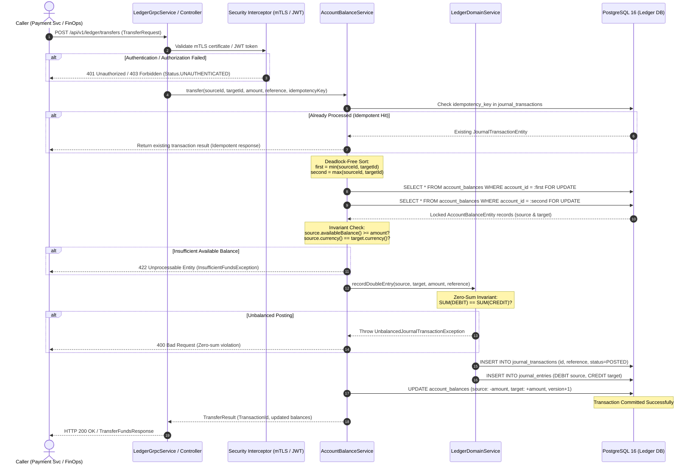

# STORY-001: Double-Entry Ledger & Atomic Balance Transfer Engine

## 📌 Story Overview
* **Target Module**: `smartpay-ledger-service`
* **Priority**: P0 (Core Financial Accounting Engine)
* **Domain Context**: Ledger & Balance Management Bounded Context
* **Associated Database Tables**: `accounts`, `account_balances`, `journal_transactions`, `journal_entries` (`V1`, `V2`)
* **Associated gRPC Contract**: `smartpay-proto/src/main/proto/ledger.proto`
* **Required `smartpay-common` Components**:
  * `Money` (Financial arithmetic, precision scaling, and currency compatibility)
  * `AccountId`, `TransactionId`, `IdempotencyKey` (Strongly-typed entity identifiers)
  * `EntryType` (`DEBIT`, `CREDIT`), `JournalStatus` (`POSTED`, `REVERSED`)
  * `InsufficientFundsException`, `UnbalancedJournalTransactionException`, `CurrencyMismatchException`, `AccountNotFoundException`
  * `LedgerTransactionPostedEvent`

---

## 🎯 User Story
> **As the** Core Financial Platform,  
> **I want to** execute atomic, double-entry, zero-sum journal postings and balance transfers under pessimistic database locking,  
> **So that** funds provenance is mathematically guaranteed, double-spending and negative balances are eliminated under high concurrency, and complete auditability is preserved.

---

## 🔄 End-to-End (E2E) Execution Flow

```
1. Client/Service Request
   │ (REST POST /api/v1/ledger/transfers OR gRPC TransferFunds / HoldFunds)
   ▼
2. Ingress Security & AuthN/AuthZ Check
   │ (Verify mTLS identity or JWT Bearer claims: ROLE_FINANCE_OPS / ROLE_SERVICE_PAYMENT)
   ▼
3. Distributed Idempotency Verification
   │ (Check if idempotency_key already processed in journal_transactions)
   ▼
4. Deadlock-Free Ordered Locking (Lexicographical Account ID sorting)
   │ (Account A: 0191c7... vs Account B: 0191c8... -> Lock lowest UUID first)
   │ (Execute: SELECT * FROM account_balances WHERE account_id = :id FOR UPDATE)
   ▼
5. Domain Validation & Invariant Ingestion
   │ (Check account currencies match)
   │ (Assert available_balance = cleared_balance - hold_balance >= transfer_amount)
   │ (Verify Zero-Sum Invariant: SUM(Debit) == SUM(Credit))
   ▼
6. Atomic State Mutation (Within single DB Transaction)
   │ - Decrement source cleared_balance_pence, increment version
   │ - Increment target cleared_balance_pence, increment version
   │ - Insert journal_transactions (status=POSTED, posted_at=NOW())
   │ - Insert journal_entries (Row 1: DEBIT source, Row 2: CREDIT target)
   ▼
7. Commit Transaction & Event Publication
   │ (Publish LedgerTransactionPostedEvent)
   ▼
8. Response Dispatch
   │ (Return 200 OK / TransferFundsResponse with updated available balances)
```

---

## 📊 Sequence Diagram



---

## 🛡️ Cross-Functional Requirements (XRF / NFRs)

### 1. Authentication & Authorization (AuthN / AuthZ)
* **Internal Inter-Service Calls (gRPC)**: Enforced via **mTLS (Mutual TLS)** with dedicated SPIFFE/X.509 certificates. Only authenticated services (`payment-service`, `recon-service`) with role `ROLE_SERVICE_PAYMENT` or `ROLE_SERVICE_RECON` are permitted.
* **External Administration Calls (REST)**: Enforced via OAuth2 / OIDC **JWT Bearer Tokens**.
  * `ROLE_FINANCE_OPS`: Can view ledger balances and trigger manual adjustment transactions.
  * `ROLE_AUDITOR`: Read-only access to `journal_transactions` and `journal_entries`.

### 2. Security & Data Protection
* **SQL Injection Prevention**: 100% parameterized queries via Spring Data JPA with typed criteria or JPQL. Raw string SQL concatenation is strictly prohibited.
* **Audit Trail Integrity**: Database trigger `trg_prevent_ledger_modification` rejects any `UPDATE` or `DELETE` statement executed against `journal_entries`, preventing database admin tampering.
* **PII & Data Masking**: Bank account numbers and balance fields are masked in application logging (`ACC-****-5821`).

### 3. Regulatory Compliance & Accessibility (a11y / Compliance)
* **Accounting Compliance (SOX / GAAP / IFRS)**: Enforces Luca Pacioli double-entry accounting. Journal lines can never be altered; correction is only possible via explicit compensating reversal transactions (`reference_type = 'REVERSAL'`).
* **Data Retention**: Financial journals must be retained for a statutory period of 7 years in immutable storage.

### 4. Performance & Scalability SLAs
* **P99 Latency**: $< 15\text{ ms}$ for two-party balance transfer.
* **Deadlock Probability**: $0.00\%$ guaranteed by ordered locking on `AccountId`.
* **Concurrency**: Handled via Java 25 Virtual Threads (`Executors.newVirtualThreadPerTaskExecutor()`).

---

## ✅ Acceptance Criteria (AC)

### AC-1: Zero-Sum Balanced Journal Posting
* **Given**: A transfer request from Account A to Account B for £250.00 GBP,
* **When**: The transaction is processed,
* **Then**: `journal_transactions` is created with status `POSTED`, and exactly 2 `journal_entries` rows are inserted (DEBIT Account A £250.00, CREDIT Account B £250.00).
* **And**: If total debits do not match total credits, `UnbalancedJournalTransactionException` is raised and database state rolls back.

### AC-2: Pessimistic Concurrency & Overdraft Prevention
* **Given**: Account A has £300.00 available balance (£400 cleared balance, £100 hold balance),
* **When**: Two concurrent transfers for £200.00 each attempt to debit Account A simultaneously,
* **Then**: The first transfer acquires the row lock, successfully debits £200.00, and leaves £100.00 available balance.
* **And**: The second transfer waits for the lock, observes £100.00 available balance, and fails with `InsufficientFundsException` (HTTP 422). Negative balance is impossible.

### AC-3: Deadlock-Free Bidirectional Transfers
* **Given**: Concurrently running Thread 1 (Account A -> Account B) and Thread 2 (Account B -> Account A),
* **When**: Both threads initiate transfers simultaneously,
* **Then**: Both threads lock the account with the smaller `AccountId` first, followed by the larger `AccountId`, preventing cyclic lock waits and completing without deadlocks.

### AC-4: Balance Hold Reservation & Capture
* **Given**: Account A with £1000 cleared balance and £0 hold balance,
* **When**: `holdFunds` is invoked for £400,
* **Then**: `hold_balance_pence` becomes £400, reducing available balance to £600.
* **When**: `releaseHold(..., capture = true)` is subsequently called,
* **Then**: `hold_balance_pence` decrements by £400, `cleared_balance_pence` decrements by £400, and a double-entry debit posting is finalized.

### AC-5: Idempotency Enforcement
* **Given**: A transfer request with `Idempotency-Key: TX-IDEMP-001`,
* **When**: The request is transmitted a second time after initial success,
* **Then**: No balances are debited a second time; the existing `JournalTransactionEntity` is returned with status `POSTED`.

---

## 🔌 API & Controller Payload Contracts

### 1. REST Management Controller (`POST /api/v1/ledger/transfers`)

#### Request Headers:
```http
POST /api/v1/ledger/transfers HTTP/1.1
Host: localhost:8081
Authorization: Bearer <JWT_TOKEN>
Idempotency-Key: 7f3b891e-b8d2-43e8-9d41-e94582f3a1b2
Content-Type: application/json
```

#### Request Payload:
```json
{
  "sourceAccountId": "0191c7a2-9b24-7f11-9a1c-3d842b10a512",
  "targetAccountId": "0191c7a2-9b24-7f11-9a1c-8e9942a0b124",
  "amountInPence": 25000,
  "currency": "GBP",
  "referenceType": "INVOICE_SETTLEMENT",
  "referenceId": "INV-2026-0841",
  "description": "Settlement payment for freight delivery load LOAD-0841"
}
```

#### Success Response (`HTTP 200 OK`):
```json
{
  "transactionId": "0191c7a2-e421-7000-8fa1-77291a45b810",
  "status": "POSTED",
  "sourceAccountId": "0191c7a2-9b24-7f11-9a1c-3d842b10a512",
  "targetAccountId": "0191c7a2-9b24-7f11-9a1c-8e9942a0b124",
  "amount": {
    "currency": "GBP",
    "amount": "250.00",
    "amountInPence": 25000
  },
  "sourceAvailableBalance": {
    "currency": "GBP",
    "amount": "750.00",
    "amountInPence": 75000
  },
  "postedAt": "2026-09-05T14:30:00.124Z"
}
```

#### Error Response - Insufficient Funds (`HTTP 422 Unprocessable Entity`):
```json
{
  "errorCode": "ERR_INSUFFICIENT_FUNDS",
  "message": "Account 0191c7a2-9b24-7f11-9a1c-3d842b10a512 has insufficient funds. Requested: GBP 250.00, Available: GBP 100.00",
  "timestamp": "2026-09-05T14:30:00.185Z"
}
```

#### Error Response - Zero-Sum Mismatch (`HTTP 400 Bad Request`):
```json
{
  "errorCode": "ERR_LEDGER_UNBALANCED",
  "message": "Journal transaction is unbalanced. Total Debit: GBP 250.00, Total Credit: GBP 240.00 (difference: GBP 10.00)",
  "timestamp": "2026-09-05T14:30:00.190Z"
}
```

---

### 2. gRPC Protocol Buffers Contract (`smartpay-proto/ledger.proto`)

#### RPC Definitions:
```protobuf
service LedgerService {
  rpc GetBalance (GetBalanceRequest) returns (GetBalanceResponse);
  rpc TransferFunds (TransferFundsRequest) returns (TransferFundsResponse);
  rpc HoldFunds (HoldFundsRequest) returns (HoldFundsResponse);
  rpc ReleaseHold (ReleaseHoldRequest) returns (ReleaseHoldResponse);
}

message TransferFundsRequest {
  string source_account_id = 1;
  string target_account_id = 2;
  smartpay.common.MoneyProto amount = 3;
  string reference = 4;
  string idempotency_key = 5;
}

message TransferFundsResponse {
  string transaction_id = 1;
  string status = 2;
  smartpay.common.MoneyProto source_new_available_balance = 3;
}
```
