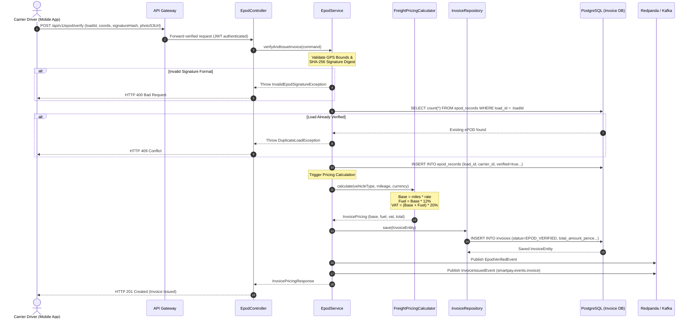

# STORY-002: Freight Invoicing & ePOD Pricing Engine

## 📌 Story Overview
* **Target Module**: `smartpay-invoice-service`
* **Priority**: P1 (Freight Billing & Electronic Delivery Verification)
* **Domain Context**: Freight Invoicing & ePOD Bounded Context
* **Associated Database Tables**: `epod_records`, `invoices` (`V3`)
* **Required `smartpay-common` Components**:
  * `Money` (Itemized freight breakdown: base freight, fuel surcharge, VAT, and gross total)
  * `InvoicePricing` (Domain pricing invariant: base + fuel + vat == total)
  * `LoadId`, `CarrierId`, `ShipperId`, `InvoiceId` (Strongly-typed IDs)
  * `GeoLocation` (Latitude/Longitude boundaries and coordinate validation)
  * `SignatureHash` (64-character SHA-256 signature verification)
  * `VehicleType` (`VAN`, `LUTON`, `7_5T`, `ARTIC`), `InvoiceStatus`
  * `InvalidEpodSignatureException`, `DuplicateLoadException`, `InvoiceAlreadySettledException`
  * `EpodVerifiedEvent`, `InvoiceIssuedEvent`

---

## 🎯 User Story
> **As a** Freight Billing Engine,  
> **I want to** cryptographically and geographically verify electronic delivery proofs (ePOD) and automatically calculate freight invoices based on mileage, vehicle type, fuel surcharge, and VAT,  
> **So that** invoices are issued within seconds of delivery with zero manual disputes, enabling immediate factoring liquidity for carriers.

---

## 🔄 End-to-End (E2E) Execution Flow

```
1. Driver Delivery Event
   │ Driver captures consignee digital signature and cargo photo at delivery point.
   ▼
2. Media Upload to S3
   │ Mobile app uploads photo to AWS S3 via presigned URL, obtaining s3_photo_url.
   ▼
3. Ingress Request
   │ POST /api/v1/epod/verify (loadId, coords, signatureHash, s3_photo_url)
   ▼
4. Security & Role Authorization Check
   │ Validate JWT Bearer: Caller must possess ROLE_CARRIER or ROLE_DISPATCHER.
   ▼
5. Cryptographic & Geospatial Verification
   │ - Assert latitude between -90 and 90, longitude between -180 and 180.
   │ - Assert signatureHash matches regular expression ^[a-fA-F0-9]{64}$.
   │ - Check epod_records: Ensure loadId is not already verified.
   ▼
6. Persist ePOD Record
   │ Save epod_records row (verified = true, created_at = NOW()).
   ▼
7. Dynamic Pricing Engine Execution
   │ - Base Rate = mileage_miles * vehicle_rate_per_mile
   │ - Fuel Surcharge = base_rate * 12%
   │ - Subtotal = base_rate + fuel_surcharge
   │ - VAT = subtotal * 20%
   │ - Total = subtotal + VAT
   ▼
8. Persist Freight Invoice
   │ Save invoices row (status = EPOD_VERIFIED, currency = "GBP", created_at = NOW()).
   ▼
9. Event Publication
   │ Publish EpodVerifiedEvent and InvoiceIssuedEvent to Redpanda/Kafka topic smartpay.events.invoice.
   ▼
10. Return Response
   │ Dispatch HTTP 201 Created with itemized InvoicePricing payload.
```

---

## 📊 Sequence Diagram



---

## 🛡️ Cross-Functional Requirements (XRF / NFRs)

### 1. Authentication & Authorization (AuthN / AuthZ)
* **ePOD Submission (`POST /api/v1/epod/verify`)**: Requires valid JWT Bearer token with claim `ROLE_CARRIER`. The `carrier_id` inside the token must match the `carrier_id` of the transport contract.
* **Invoice Reading (`GET /api/v1/invoices/{id}`)**: Requires `ROLE_SHIPPER` (the consignor) or `ROLE_CARRIER` (the transporter) or `ROLE_FINANCE_OPS`. Multi-tenant data segregation is strictly enforced.

### 2. Security & Tamper Detection
* **Cryptographic Signatures**: The recipient's on-glass signature image is hashed using SHA-256 on the mobile client. Only the hash is transmitted over the wire to protect against in-transit image manipulation.
* **Direct-to-S3 Upload**: Delivery photos are uploaded directly from mobile clients to S3 using short-lived (15-minute) AWS presigned URLs, avoiding binary media transport through application servers.

### 3. Regulatory Compliance & Accessibility (a11y / Compliance)
* **UK HMRC Tax Compliance**: Invoices meet all requirements for legal VAT invoices under UK tax law (HMRC Notice 700/63), displaying VAT registration number, net rate, fuel surcharge breakdown, VAT rate (20%), and total payable.
* **Mobile Driver Accessibility (a11y)**: Mobile interfaces submitting ePOD data must adhere to WCAG 2.1 AA (touch targets $\ge 48\times 48\text{ dp}$, high contrast for outdoor sunlight readability).

### 4. Performance & Scalability SLAs
* **P99 Latency**: $< 25\text{ ms}$ for invoice pricing calculation and database persistence.
* **Throughput**: Capable of handling $500\text{ deliveries/sec}$ peak volume across logistics fulfillment hubs.

---

## ✅ Acceptance Criteria (AC)

### AC-1: Electronic Delivery Proof (ePOD) Verification
* **Given**: A carrier driver delivers freight for load `LOAD-UK-2026-0841`,
* **When**: Submitting GPS coordinates (51.5074, -0.1278), a valid 64-character SHA-256 signature hash, and an S3 photo link,
* **Then**: An `epod_records` row is persisted with `verified = true`, and an `EpodVerifiedEvent` is emitted to Kafka.
* **And**: If the signature hash is invalid (e.g. not 64 hex characters), `InvalidEpodSignatureException` is thrown (HTTP 400).

### AC-2: Freight Invoice Itemized Pricing Calculation
* **Given**: A freight load of 150 miles hauled by an `ARTIC` vehicle (£3.50/mile),
* **When**: The pricing calculator generates the invoice:
  * Base Amount: $150 \times £3.50 = £525.00$
  * Fuel Surcharge (12%): $£525.00 \times 0.12 = £63.00$
  * Subtotal: $£525.00 + £63.00 = £588.00$
  * VAT (20%): $£588.00 \times 0.20 = £117.60$
  * Total Gross Amount: $£588.00 + £117.60 = £705.60$
* **Then**: The invoice is stored in `invoices` with `status = EPOD_VERIFIED` and `total_amount_pence = 70560`.

### AC-3: Multi-Currency Invoice Support
* **Given**: An international cross-border load from Dover to Calais invoiced in `EUR`,
* **When**: The invoice is generated with currency set to `EUR`,
* **Then**: The invoice entity preserves `currency = "EUR"`, and all `Money` value objects within `InvoicePricing` evaluate with currency `EUR`.

### AC-4: Duplicate Delivery Prevention
* **Given**: A load that has already been verified and invoiced,
* **When**: A second ePOD verification request is submitted for the same `load_id`,
* **Then**: The transaction is rejected with `DuplicateLoadException` (HTTP 409 Conflict).

### AC-5: Settlement Mutability Lock
* **Given**: An invoice with status `SETTLED`,
* **When**: An update or cancellation is attempted,
* **Then**: The operation is rejected with `InvoiceAlreadySettledException` (HTTP 422).

---

## 🔌 API & Controller Payload Contracts

### 1. ePOD Verification Endpoint (`POST /api/v1/epod/verify`)

#### Request Headers:
```http
POST /api/v1/epod/verify HTTP/1.1
Host: localhost:8083
Authorization: Bearer <JWT_CARRIER_TOKEN>
Idempotency-Key: epod-proof-0191c7-0841
Content-Type: application/json
```

#### Request Payload:
```json
{
  "loadId": "LOAD-2026-UK-0841",
  "carrierId": "0191c7a2-9b24-7f11-9a1c-3d842b10a512",
  "deliveredAt": "2026-09-05T14:45:10Z",
  "latitude": 51.5074000,
  "longitude": -0.1278000,
  "photoS3Url": "https://s3.eu-west-2.amazonaws.com/smartpay-epod-production/loads/LOAD-0841.jpg",
  "signatureHash": "e3b0c44298fc1c149afbf4c8996fb92427ae41e4649b934ca495991b7852b855"
}
```

#### Success Response (`HTTP 201 Created`):
```json
{
  "epodId": "0191c7b0-4412-7000-8fa1-aa1290bb3410",
  "loadId": "LOAD-2026-UK-0841",
  "carrierId": "0191c7a2-9b24-7f11-9a1c-3d842b10a512",
  "verified": true,
  "deliveredAt": "2026-09-05T14:45:10Z",
  "createdAt": "2026-09-05T14:45:12.412Z"
}
```

#### Error Response - Invalid Signature (`HTTP 400 Bad Request`):
```json
{
  "errorCode": "ERR_INVALID_EPOD_SIGNATURE",
  "message": "Electronic Proof of Delivery (ePOD) cryptographic signature verification failed for load LOAD-2026-UK-0841",
  "timestamp": "2026-09-05T14:45:12.450Z"
}
```

---

### 2. Create Invoice Endpoint (`POST /api/v1/invoices`)

#### Request Payload:
```json
{
  "loadId": "LOAD-2026-UK-0841",
  "shipperId": "0191c7a2-9b24-7f11-9a1c-8e9942a0b124",
  "carrierId": "0191c7a2-9b24-7f11-9a1c-3d842b10a512",
  "vehicleType": "ARTIC",
  "mileageMiles": 150.00,
  "currency": "GBP"
}
```

#### Success Response (`HTTP 201 Created`):
```json
{
  "invoiceId": "0191c7b1-1209-7000-91ab-cc849100fa51",
  "loadId": "LOAD-2026-UK-0841",
  "shipperId": "0191c7a2-9b24-7f11-9a1c-8e9942a0b124",
  "carrierId": "0191c7a2-9b24-7f11-9a1c-3d842b10a512",
  "vehicleType": "ARTIC",
  "mileageMiles": 150.00,
  "currency": "GBP",
  "pricing": {
    "baseAmount": "525.00",
    "baseAmountPence": 52500,
    "fuelSurcharge": "63.00",
    "fuelSurchargePence": 6300,
    "vatAmount": "117.60",
    "vatAmountPence": 11760,
    "totalAmount": "705.60",
    "totalAmountPence": 70560
  },
  "status": "EPOD_VERIFIED",
  "createdAt": "2026-09-05T14:45:15.102Z"
}
```
