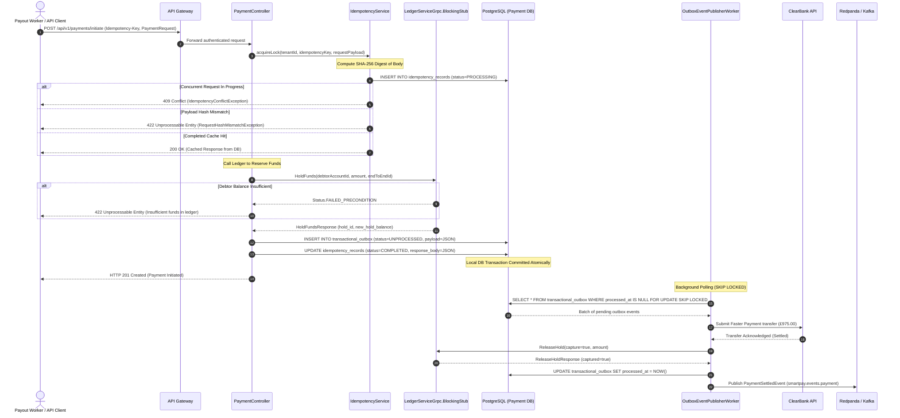

# STORY-003: Payment Initiation & Transactional Outbox Engine

## 📌 Story Overview
* **Target Module**: `smartpay-payment-service`
* **Priority**: P1 (Payment Orchestration & Distributed Consistency)
* **Domain Context**: Payment & Settlement Bounded Context
* **Associated Database Tables**: `transactional_outbox` (`V4`), `idempotency_records` (`V5`)
* **Associated gRPC Dependency**: `smartpay-ledger-service` (`smartpay-proto/src/main/proto/ledger.proto`)
* **Required `smartpay-common` Components**:
  * `Money` (Disbursement amounts, fee calculations, and currency integrity)
  * `AccountId`, `TenantId`, `IdempotencyKey`, `EndToEndId` (Strongly-typed IDs)
  * `IdempotencyStatus` (`PROCESSING`, `COMPLETED`, `FAILED`)
  * `IdempotencyConflictException`, `RequestHashMismatchException`, `DuplicateTransactionException`
  * `OutboxEvent` (At-least-once outbox persistence)

---

## 🎯 User Story
> **As a** Payment Orchestration Service,  
> **I want to** initiate Faster Payments and VRP disbursements with two-tier idempotency protection, reserve debtor balances via Ledger gRPC, and commit events to a Transactional Outbox,  
> **So that** duplicate withdrawals are eliminated under client retries and outbox events are guaranteed to stream into Kafka with zero dual-write data loss.

---

## 🔄 End-to-End (E2E) Execution Flow

```
1. Payment Initiation Trigger
   │ Ingress request: POST /api/v1/payments/initiate with mandatory Idempotency-Key header.
   ▼
2. Security & Token Authentication
   │ Validate caller JWT claims (ROLE_PAYMENT_INITIATOR or ROLE_SHIPPER).
   ▼
3. Tier-1 Idempotency Check: Request Fingerprinting
   │ Compute SHA-256 cryptographic digest of raw HTTP JSON payload.
   ▼
4. Tier-2 Idempotency Check: Database Lock Acquisition
   │ Insert into idempotency_records (tenant_id, idempotency_key, request_hash, status='PROCESSING').
   │ - If duplicate key in 'PROCESSING': Throw IdempotencyConflictException (HTTP 409).
   │ - If duplicate key with differing hash: Throw RequestHashMismatchException (HTTP 422).
   │ - If duplicate key in 'COMPLETED': Short-circuit and return cached response immediately.
   ▼
5. Ledger Balance Reservation (gRPC Call)
   │ Synchronous RPC call to smartpay-ledger-service: HoldFunds(debtorAccountId, amount, endToEndId).
   │ Ledger acquires pessimistic lock and increments hold_balance_pence.
   ▼
6. Transactional Outbox Commitment
   │ Within local DB transaction, insert transactional_outbox row:
   │ (aggregate_type='PAYMENT', aggregate_id=paymentId, event_type='PAYMENT_INITIATED', payload=JSON).
   │ Update idempotency_records status = 'COMPLETED', store response body.
   ▼
7. Commit Database Transaction & Return Response
   │ Return HTTP 201 Created with PaymentResponse DTO.
   ▼
8. Asynchronous Outbox Worker Execution (Virtual Thread Pool)
   │ SELECT * FROM transactional_outbox WHERE processed_at IS NULL ORDER BY created_at ASC FOR UPDATE SKIP LOCKED
   │ - Dispatch payment order to external banking rail (ClearBank / Faster Payments API).
   │ - Upon bank confirmation, call Ledger gRPC: ReleaseHold(capture=true).
   │ - Update transactional_outbox SET processed_at = NOW().
   │ - Publish PaymentSettledEvent to Kafka topic smartpay.events.payment.
```

---

## 📊 Sequence Diagram



---

## 🛡️ Cross-Functional Requirements (XRF / NFRs)

### 1. Authentication & Authorization (AuthN / AuthZ)
* **API Access (`POST /api/v1/payments/initiate`)**: Enforced via OAuth2 JWT Bearer tokens with scope `payments:write` and role `ROLE_PAYMENT_INITIATOR` or `ROLE_PAYOUT_WORKER`.
* **Tenant Isolation**: The `tenant_id` claim extracted from the JWT token must match the path/payload `tenant_id`, guaranteeing multi-tenant cryptographic isolation.

### 2. Security & Anti-Tampering Protection
* **Request Body Fingerprinting**: The SHA-256 hash ensures that any replay attack attempting to reuse an existing idempotency key with modified payee details or amounts is immediately blocked.
* **Sensitive Data Redaction**: Payee sort codes, account numbers, and virtual IBANs are encrypted at rest using AES-256-GCM and masked in application logs (`GB**CLEAR****9821`).

### 3. Regulatory Compliance & Accessibility (a11y / Compliance)
* **Payment Services Directive (PSD2 / Open Banking UK)**: Compliant with UK Faster Payments Scheme rules and Strong Customer Authentication (SCA) exemptions for automated logistics factoring payouts.
* **Audit Provenance**: Every payment record maintains an unbroken cryptographic lineage connecting `InvoiceId` -> `IdempotencyKey` -> `EndToEndId` -> `TransactionId`.

### 4. Performance & Scalability SLAs
* **Initiation Latency (P99)**: $< 20\text{ ms}$ to acquire lock, call Ledger gRPC, and commit the outbox event.
* **Outbox Polling Lag**: Event pickup by outbox workers within $< 500\text{ ms}$ of database commit.
* **Worker Concurrency**: Polling executed across Java 25 Virtual Threads using `FOR UPDATE SKIP LOCKED`, preventing thread exhaustion under heavy bursts.

---

## ✅ Acceptance Criteria (AC)

### AC-1: Idempotent Payment Initiation with Ledger Hold
* **Given**: A valid payment request for £975.00 with `Idempotency-Key: PAY-KEY-001`,
* **When**: `initiatePayment` is processed,
* **Then**: An `idempotency_records` row is created, `HoldFunds` is executed on Ledger gRPC, and a `transactional_outbox` row is saved in the same transaction.
* **And**: The client receives HTTP 201 Created with status `INITIATED` and the generated `EndToEndId`.

### AC-2: Immediate Cache Short-Circuit on Duplicate Submissions
* **Given**: A completed payment with `Idempotency-Key: PAY-KEY-001`,
* **When**: A second request arrives with the identical key and payload,
* **Then**: The Ledger gRPC service is NOT called, no additional outbox event is persisted, and the original HTTP response is served with header `X-Cache: IDEMPOTENT-HIT`.

### AC-3: Request Tamper Rejection (Hash Mismatch)
* **Given**: An existing key `PAY-KEY-001` originally submitted for £975.00,
* **When**: A second request arrives with `Idempotency-Key: PAY-KEY-001` but with amount altered to £1500.00,
* **Then**: The request is rejected with `RequestHashMismatchException` (HTTP 422 Unprocessable Entity).

### AC-4: Non-Blocking Outbox Polling (SKIP LOCKED)
* **Given**: 100 unprocessed events in `transactional_outbox`,
* **When**: 4 concurrent worker threads poll the outbox simultaneously,
* **Then**: Each worker receives 25 disjoint rows without lock contention or thread blocks.

### AC-5: Guaranteed Hold Capture Upon Bank Settlement
* **Given**: A pending outbox payment event,
* **When**: The external bank confirms settlement,
* **Then**: Ledger gRPC `ReleaseHold(capture=true)` is executed, `transactional_outbox.processed_at` is set, and a `PaymentSettledEvent` is published to Kafka.

---

## 🔌 API & Controller Payload Contracts

### 1. Payment Initiation Endpoint (`POST /api/v1/payments/initiate`)

#### Request Headers:
```http
POST /api/v1/payments/initiate HTTP/1.1
Host: localhost:8082
Authorization: Bearer <JWT_PAYMENT_TOKEN>
Idempotency-Key: pay-disburse-0191c7-9912
Content-Type: application/json
```

#### Request Payload:
```json
{
  "tenantId": "TENANT-UK-01",
  "debtorAccountId": "0191c7a2-9b24-7f11-9a1c-3d842b10a512",
  "creditorAccountId": "0191c7a2-9b24-7f11-9a1c-8e9942a0b124",
  "amountInPence": 97500,
  "currency": "GBP",
  "paymentMethod": "FASTER_PAYMENTS",
  "reference": "PAYOUT-INV-0841",
  "creditorSortCode": "20-00-00",
  "creditorAccountNumber": "12345678"
}
```

#### Success Response (`HTTP 201 Created`):
```json
{
  "paymentId": "0191c7c4-8891-7000-84a1-00aa4912fa99",
  "status": "INITIATED",
  "amount": {
    "currency": "GBP",
    "amount": "975.00",
    "amountInPence": 97500
  },
  "endToEndId": "E2E-SMARTPAY-20260905-9912",
  "debtorAccountId": "0191c7a2-9b24-7f11-9a1c-3d842b10a512",
  "creditorAccountId": "0191c7a2-9b24-7f11-9a1c-8e9942a0b124",
  "createdAt": "2026-09-05T15:00:10.124Z"
}
```

#### Error Response - Concurrent In-Flight Conflict (`HTTP 409 Conflict`):
```json
{
  "errorCode": "ERR_IDEMPOTENCY_CONFLICT",
  "message": "Concurrent or conflicting request in progress for idempotency key pay-disburse-0191c7-9912 (status: PROCESSING)",
  "timestamp": "2026-09-05T15:00:10.450Z"
}
```

#### Error Response - Request Hash Mismatch (`HTTP 422 Unprocessable Entity`):
```json
{
  "errorCode": "ERR_REQUEST_HASH_MISMATCH",
  "message": "Idempotency key pay-disburse-0191c7-9912 was already used with a different request payload",
  "timestamp": "2026-09-05T15:00:11.002Z"
}
```

---

### 2. Payment Status Query Endpoint (`GET /api/v1/payments/{id}/status`)

#### Success Response (`HTTP 200 OK`):
```json
{
  "paymentId": "0191c7c4-8891-7000-84a1-00aa4912fa99",
  "status": "SETTLED",
  "amount": {
    "currency": "GBP",
    "amount": "975.00",
    "amountInPence": 97500
  },
  "endToEndId": "E2E-SMARTPAY-20260905-9912",
  "settledAt": "2026-09-05T15:00:12.850Z",
  "bankTransactionReference": "CLEARBANK-FPS-99884210"
}
```
