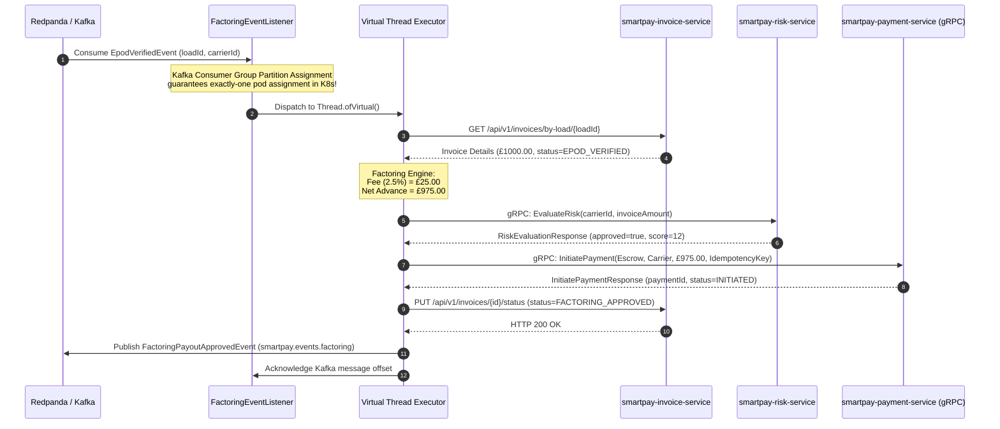

# STORY-004: Carrier Factoring & Instant Payout Worker

## 📌 Story Overview
* **Target Module**: `smartpay-payout-worker`
* **Priority**: P1 (Factoring Liquidity & Automated Cashflow Engine)
* **Domain Context**: Factoring Payout Bounded Context
* **Associated Services**: `smartpay-invoice-service`, `smartpay-payment-service`, `smartpay-risk-service`
* **Required `smartpay-common` Components**:
  * `Money` (Gross invoice, factoring fee, and net payout calculation)
  * `CarrierId`, `InvoiceId`, `TransactionId` (Strongly-typed IDs)
  * `FactoringPayoutApprovedEvent`
  * Virtual Threads (`Executors.newVirtualThreadPerTaskExecutor()`)

---

## 🎯 User Story
> **As an** Event-Driven Factoring Liquidity Worker,  
> **I want to** consume verified delivery events from Kafka in a partitioned consumer group, evaluate carrier credit risk via gRPC, deduct a 2.5% factoring platform fee, and execute instant payouts via Payment gRPC,  
> **So that** freight carriers receive instant liquidity in real-time (< 1s) upon delivery completion with zero polling overhead or multi-pod race conditions across Kubernetes replicas.
---

## 🔄 End-to-End (E2E) Execution Flow

```
1. Event-Driven Trigger (Kafka Consumer Group)
   │ Consumer group `smartpay-factoring-workers` consumes `EpodVerifiedEvent` from topic `smartpay.events.invoice`.
   │ Kubernetes multi-pod scaling is conflict-free: Kafka partition assignment guarantees
   │ that exactly one worker pod processes a given delivery event.
   ▼
2. Invoice & Load Verification
   │ Fetch invoice details for loadId from smartpay-invoice-service (status = EPOD_VERIFIED).
3. Factoring Fee Calculation (Domain Service)
   │ - Factoring Fee (2.5%) = Gross Invoice Total * 0.025
   │ - Net Payout Amount = Gross Invoice Total - Factoring Fee
   ▼
4. Risk & Fraud Assessment (gRPC Call)
   │ Call smartpay-risk-service (EvaluateCarrierRisk):
   │ - Assert carrier risk_score < threshold (e.g. < 40).
   │ - If flagged, abort factoring advance and alert compliance team.
   ▼
5. Virtual Thread Execution per Invoice
   │ Spawn Thread.ofVirtual() for each approved invoice to parallelize I/O calls.
   ▼
6. Payment Initiation via Payment gRPC
   │ Invoke smartpay-payment-service (InitiatePayment):
   │ - Debtor: Platform Escrow Account
   │ - Creditor: Carrier Verified Account
   │ - Amount: Net Payout Amount (£975.00)
   ▼
7. Update Invoice State
   │ Update invoice in smartpay-invoice-service: status = FACTORING_APPROVED.
   ▼
8. Audit & Event Dispatch
   │ Publish FactoringPayoutApprovedEvent to Kafka topic smartpay.events.factoring.
```

---

## 📊 Sequence Diagram



---

## 🛡️ Cross-Functional Requirements (XRF / NFRs)

### 1. Authentication & Authorization (AuthN / AuthZ)
* **Service-to-Service Security**: All interactions with `payment-service` and `invoice-service` are secured via **mTLS**. The worker uses identity certificate `spiffe://smartpay.internal/ns/workers/sa/payout-worker`.
* **RBAC Role**: Authenticates with role `ROLE_PAYOUT_WORKER`, restricted exclusively to disbursement initiation.

### 2. Security & Anti-Fraud Protection
* **Maximum Daily Advance Cap**: Hard limit of £50,000 advance per carrier per day unless an override is granted by Financial Operations.
* **Anti-Collusion Verification**: The worker ensures the shipper and carrier do not share identical banking credentials, directors, or registered business addresses.

### 3. Regulatory Compliance & Accessibility (a11y / Compliance)
* **UK Factoring & Commercial Credit Transparency**: The 2.5% factoring fee and net advance calculation must be explicitly documented on the PDF remittance advice sent to the carrier.
* **Audit Lineage**: The factoring transaction preserves the exact mathematical trail linking `InvoiceId` -> `GrossAmount` -> `FactoringFee` -> `NetPayout` -> `PaymentId`.

### 4. Performance & Scalability SLAs
* **Throughput**: Capable of evaluating and initiating payouts for 1,000 invoices in $< 5\text{ seconds}$ via Java 25 Virtual Threads (`Thread.ofVirtual()`).
* **Resource Consumption**: Minimal memory footprint ($< 256\text{ MB}$ heap) due to zero OS thread retention.

---

## ✅ Acceptance Criteria (AC)

### AC-1: Accurate 2.5% Factoring Fee Calculation
* **Given**: An invoice with total amount £1,000.00 GBP,
* **When**: The factoring fee calculation executes,
* **Then**: The factoring fee evaluates to £25.00 GBP, and net disbursement evaluates to £975.00 GBP.
* **And**: Rounding uses `RoundingMode.HALF_UP` preserving the exact currency minor unit.

### AC-2: Fraud Score Rejection
* **Given**: A verified invoice whose carrier risk score exceeds 40 (e.g. score = 75),
* **When**: The factoring worker evaluates the invoice,
* **Then**: No payment order is dispatched to `smartpay-payment-service`, the invoice remains unadvanced, and an alert is flagged in ops logs.

### AC-3: Factoring Disbursement via Payment gRPC
* **Given**: A risk-approved invoice for net payout £975.00,
* **When**: The worker executes the payout,
* **Then**: `PaymentService.InitiatePayment` is invoked with `idempotency_key = "FACTORING-INV-" + invoiceId`, and the invoice transitions to `FACTORING_APPROVED`.

### AC-4: Virtual Thread Isolation
* **Given**: A batch of 500 invoices processed concurrently,
* **When**: Several external banking or gRPC calls experience transient latency,
* **Then**: Operating system carrier threads remain unpinned, and healthy invoices proceed without delay.


### AC-5: Multi-Pod Kubernetes Partition Safety (No Concurrent Duplication)
* **Given**: A Kubernetes deployment of `smartpay-payout-worker` running with 4 active replica pods,
* **When**: Multiple `EpodVerifiedEvent` messages are published to `smartpay.events.invoice`,
* **Then**: Kafka partition assignments ensure each message is handled by exactly one pod, resulting in zero 409 conflict errors and zero duplicate disbursements.
---

## 🔌 API & Event Payload Contracts

### 1. Payment gRPC Dispatch Payload (Outbound to `smartpay-payment-service`)

```protobuf
InitiatePaymentRequest {
  tenant_id: "TENANT-UK-01"
  idempotency_key: "FACTORING-ADVANCE-INV-2026-0841"
  debtor_account_id: "0191c7a2-9b24-7f11-9a1c-3d842b10a512" // Platform Escrow
  creditor_account_id: "0191c7a2-9b24-7f11-9a1c-8e9942a0b124" // Carrier Account
  amount: MoneyProto {
    currency: "GBP"
    amount_in_pence: 97500
  }
  payment_method: FASTER_PAYMENTS
  payment_reference: "ADV-INV-0841"
  end_to_end_id: "E2E-SMARTPAY-FACT-0841"
}
```

---

### 2. Factoring Payout Event (`smartpay.events.factoring`)

```json
{
  "eventId": "0191c7d0-1124-7000-8fa1-cc0984a1b510",
  "eventType": "FACTORING_PAYOUT_APPROVED",
  "aggregateId": "0191c7b1-1209-7000-91ab-cc849100fa51",
  "invoiceId": "0191c7b1-1209-7000-91ab-cc849100fa51",
  "carrierId": "0191c7a2-9b24-7f11-9a1c-3d842b10a512",
  "grossAmount": {
    "currency": "GBP",
    "amount": "1000.00",
    "amountInPence": 100000
  },
  "factoringFee": {
    "currency": "GBP",
    "amount": "25.00",
    "amountInPence": 2500
  },
  "netPayoutAmount": {
    "currency": "GBP",
    "amount": "975.00",
    "amountInPence": 97500
  },
  "occurredAt": "2026-09-05T15:15:00.250Z"
}
```
