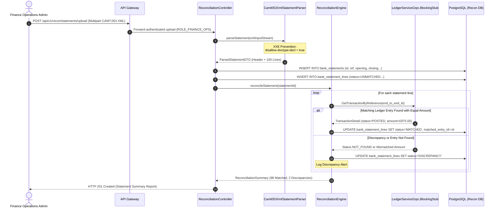

# STORY-005: Bank Statement & Auto-Reconciliation Engine

## 📌 Story Overview
* **Target Module**: `smartpay-recon-service`
* **Priority**: P2 (Financial Control & Bank Statement Reconciliation)
* **Domain Context**: Bank Statement Reconciliation Bounded Context
* **Associated Database Tables**: `bank_statements`, `bank_statement_lines` (schema `recon`, Flyway `V1`)
* **Associated Services**: `smartpay-ledger-service` (`smartpay-proto/src/main/proto/ledger.proto`)
* **Required `smartpay-common` Components**:
  * `Money` (Opening/closing balances, line amounts, currency verification)
  * `StatementReference`, `EndToEndId` (Strongly-typed IDs)
  * `EntryType`, `ReconciliationStatus` (`UNMATCHED`, `MATCHED`, `MANUALLY_ADJUSTED`)
  * `UnmatchedBankStatementException`

---

## 🎯 User Story
> **As a** Finance Operations Manager,  
> **I want to** ingest ISO-20022 CAMT.053 XML and MT940 bank statements from clearing banks (e.g. ClearBank, Barclays) and automatically match statement lines against ledger journal entries using `end_to_end_id`,  
> **So that** bank account cash positions match internal ledger balances and discrepancies are identified in minutes rather than during month-end closes.

---

## 🔄 End-to-End (E2E) Execution Flow

```
1. Statement File Ingestion
   │ Finance Operations Admin uploads CAMT.053 XML statement via POST /api/v1/recon/statements/upload.
   ▼
2. Ingress Security & XXE Sanitization
   │ Validate JWT Bearer: Caller must possess ROLE_FINANCE_OPS.
   │ Configure XML parser with DISALLOW_DOCTYPE_DECL to prevent XML External Entity (XXE) attacks.
   ▼
3. Statement Parsing & Storage
   │ Parse statement header (bank_name, account_number, statement_date, opening/closing balance).
   │ Save bank_statements row.
   │ Parse statement lines (end_to_end_id, amount_in_pence, entry_type, booking_date).
   │ Save bank_statement_lines rows with reconciliation_status = 'UNMATCHED'.
   ▼
4. Automated Reconciliation Engine Execution
   │ For each unmatched statement line:
   │ - Query smartpay-ledger-service via gRPC: GetTransactionByReference(end_to_end_id).
   │ - Invariant Checks:
   │     1. Does journal transaction exist?
   │     2. Does statement amount equal ledger amount to the exact penny?
   │     3. Does statement currency equal ledger currency?
   │     4. Does entry direction match (Bank DEBIT == Ledger Escrow DEBIT)?
   ▼
5. Status Mutation
   │ - If all invariants pass: Update bank_statement_lines set reconciliation_status = 'MATCHED', matched_entry_id = entry.id.
   │ - If mismatch or missing: Update bank_statement_lines set reconciliation_status = 'DISCREPANCY'.
   ▼
6. Summary Report Dispatch
   │ Return HTTP 201 Created with StatementUploadResponse detailing matched lines and discrepancies.
```

---

## 📊 Sequence Diagram



---

## 🛡️ Cross-Functional Requirements (XRF / NFRs)

### 1. Authentication & Authorization (AuthN / AuthZ)
* **Access Control**: Uploading and reconciling statements is restricted to users with `ROLE_FINANCE_OPS`.
* **Auditing**: Every reconciliation run logs the user identity, statement reference, matching rate, and timestamp.

### 2. Security & XXE Injection Prevention
* **Secure XML Processing**: The XML parser strictly disables DOCTYPE declarations, external general entities, and parameter entities:
  ```java
  DocumentBuilderFactory dbf = DocumentBuilderFactory.newInstance();
  dbf.setFeature("http://apache.org/xml/features/disallow-doctype-decl", true);
  dbf.setFeature("http://xml.org/sax/features/external-general-entities", false);
  ```
* **Payload Size Limits**: Max upload file size is capped at $20\text{ MB}$ per file to prevent Denial of Service (DoS).

### 3. Regulatory Compliance & Accessibility (a11y / Compliance)
* **ISO-20022 Standard Alignment**: Fully supports ISO-20022 `camt.053.001.02` and `camt.053.001.08` XML schemas.
* **Financial Provenance**: Reconciliation links bank cash balances directly to internal ledger journal entries for external statutory auditors.

### 4. Performance & Scalability SLAs
* **Throughput**: Ingestion and automated matching of a 10,000-line bank statement completes in $< 3\text{ seconds}$.

---

## ✅ Acceptance Criteria (AC)

### AC-1: CAMT.053 XML Parsing & Ingestion
* **Given**: A valid ISO-20022 CAMT.053 XML file containing 100 statement entries,
* **When**: The file is uploaded,
* **Then**: The statement header is saved to `bank_statements` and all 100 lines are stored in `bank_statement_lines` with `status = UNMATCHED`.

### AC-2: Exact EndToEndId Match & Status Transition
* **Given**: An unmatched statement line for £975.00 with `EndToEndId: E2E-FACT-0841`,
* **When**: The reconciliation engine matches it against a ledger transaction with identical reference, amount, and currency,
* **Then**: The statement line transitions to `reconciliation_status = MATCHED` and records the `matched_entry_id`.

### AC-3: Amount Discrepancy Detection
* **Given**: A statement line of £975.00 matching an `EndToEndId` whose ledger transaction was recorded as £950.00 (e.g. unexpected bank fee),
* **When**: Reconciliation runs,
* **Then**: The line is flagged with `reconciliation_status = DISCREPANCY`, preserving an audit note of the £25.00 variance.

### AC-4: XXE Attack Rejection
* **Given**: A malicious XML file containing external DTD entity expansion payloads,
* **When**: Ingestion is attempted,
* **Then**: The parser rejects the file with an `IllegalArgumentException` (HTTP 400 Bad Request) without executing external network calls.

---

## 🔌 API & Controller Payload Contracts

### 1. Statement Upload Endpoint (`POST /api/v1/recon/statements/upload`)

#### Request:
```http
POST /api/v1/recon/statements/upload HTTP/1.1
Host: localhost:8084
Authorization: Bearer <JWT_FINANCE_OPS_TOKEN>
Content-Type: multipart/form-data; boundary=----WebKitFormBoundary7MA4YWxkTrZu0gW

------WebKitFormBoundary7MA4YWxkTrZu0gW
Content-Disposition: form-data; name="bankName"

ClearBank
------WebKitFormBoundary7MA4YWxkTrZu0gW
Content-Disposition: form-data; name="file"; filename="CAMT053_20260905.xml"
Content-Type: application/xml

<?xml version="1.0" encoding="UTF-8"?>
<Document xmlns="urn:iso:std:iso:20022:tech:xsd:camt.053.001.02">
  <!-- XML statement content -->
</Document>
------WebKitFormBoundary7MA4YWxkTrZu0gW--
```

#### Success Response (`HTTP 201 Created`):
```json
{
  "statementId": "0191c7e0-2210-7000-84a1-09aa12bc4410",
  "statementReference": "STMT-CLEARBANK-2026-09-05-001",
  "bankName": "ClearBank",
  "accountNumber": "12345678",
  "statementDate": "2026-09-05",
  "currency": "GBP",
  "openingBalance": {
    "currency": "GBP",
    "amount": "100000.00",
    "amountInPence": 10000000
  },
  "closingBalance": {
    "currency": "GBP",
    "amount": "145000.00",
    "amountInPence": 14500000
  },
  "totalLinesParsed": 100,
  "matchedLines": 98,
  "discrepancyLines": 2,
  "uploadedAt": "2026-09-05T15:30:10.120Z"
}
```

---

### 2. Query Statement Lines Endpoint (`GET /api/v1/recon/statements/{id}/lines`)

#### Success Response (`HTTP 200 OK`):
```json
[
  {
    "id": "0191c7e0-4512-7000-91ab-cc8491001122",
    "statementId": "0191c7e0-2210-7000-84a1-09aa12bc4410",
    "statementReference": "STMT-CLEARBANK-2026-09-05-001",
    "endToEndId": "E2E-SMARTPAY-FACT-0841",
    "amount": {
      "currency": "GBP",
      "amount": "975.00",
      "amountInPence": 97500
    },
    "entryType": "DEBIT",
    "bookingDate": "2026-09-05",
    "reconciliationStatus": "MATCHED",
    "matchedEntryId": "0191c7a2-e421-7000-8fa1-77291a45b810"
  },
  {
    "id": "0191c7e0-4512-7000-91ab-cc8491001123",
    "statementId": "0191c7e0-2210-7000-84a1-09aa12bc4410",
    "statementReference": "STMT-CLEARBANK-2026-09-05-001",
    "endToEndId": "E2E-UNKNOWN-REF-9911",
    "amount": {
      "currency": "GBP",
      "amount": "120.00",
      "amountInPence": 12000
    },
    "entryType": "CREDIT",
    "bookingDate": "2026-09-05",
    "reconciliationStatus": "UNMATCHED",
    "matchedEntryId": null
  }
]
```
