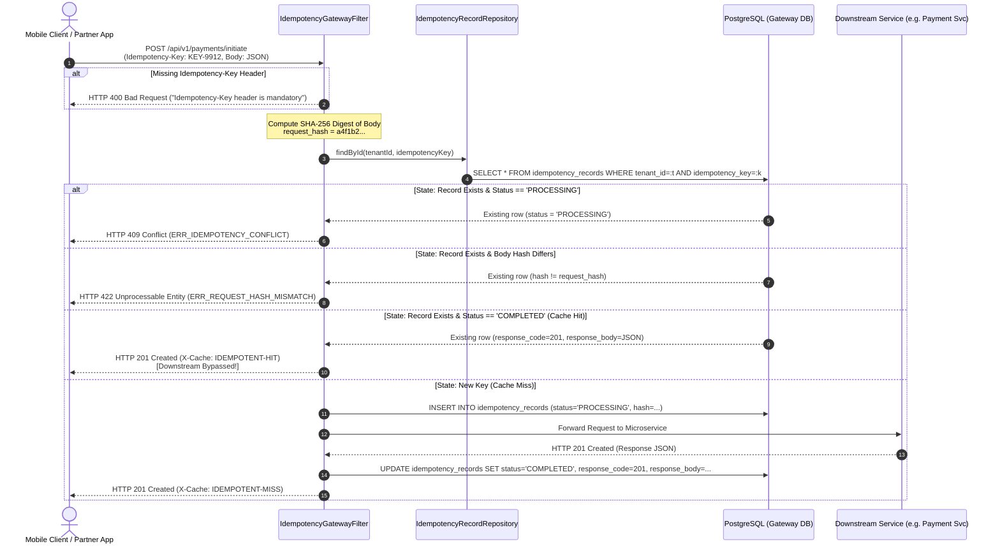

# STORY-006: API Gateway & Distributed Idempotency Filter

## 📌 Story Overview
* **Target Module**: `smartpay-gateway`
* **Priority**: P2 (Ingress Perimeter Security & Edge Idempotency)
* **Domain Context**: API Gateway & Perimeter Ingress Bounded Context
* **Associated Database Tables**: `idempotency_records` (gateway schema, Flyway `V1`)
* **Required `smartpay-common` Components**:
  * `TenantId`, `IdempotencyKey` (Strongly-typed IDs)
  * `IdempotencyStatus` (`PROCESSING`, `COMPLETED`, `FAILED`)
  * `IdempotencyConflictException`, `RequestHashMismatchException`

---

## 🎯 User Story
> **As the** Edge API Gateway,  
> **I want to** intercept incoming financial mutation requests (POST/PUT), validate mandatory `Idempotency-Key` headers, compute SHA-256 request body fingerprints, and cache completed responses,  
> **So that** network timeouts and mobile client retries are resolved instantly at the perimeter without triggering duplicate downstream microservice workloads.

---

## 🔄 End-to-End (E2E) Execution Flow

```
1. External Ingress Request
   │ Client (Web UI / Mobile App / Partner Integration) sends HTTP POST / PUT request to API Gateway.
   ▼
2. Edge Rate Limiting & DoS Protection
   │ Token bucket rate limiter evaluates request per API key / IP address.
   ▼
3. JWT Authentication & Tenant Context Extraction
   │ Verify signature, expiry, and extract claims (sub, tenant_id, roles).
   ▼
4. Financial Route Inspection
   │ Check if target route is a mutating financial path (/api/v1/payments/**, /api/v1/invoices/**).
   │ - If yes: Assert Idempotency-Key header is present. If missing, abort with HTTP 400 Bad Request.
   ▼
5. Request Body Caching & Cryptographic Hashing
   │ Wrap HttpServletRequest in a cached wrapper to allow multiple stream reads.
   │ Compute SHA-256 hex digest of the raw JSON body (request_hash).
   ▼
6. Two-Tier Idempotency State Machine Query
   │ Query idempotency_records WHERE tenant_id = :tenantId AND idempotency_key = :key:
   │ - State A (Not Found): INSERT status='PROCESSING', request_hash=:hash, expires_at=NOW()+24h.
   │ - State B (Found, status='PROCESSING'): Abort immediately with HTTP 409 Conflict.
   │ - State C (Found, status='COMPLETED'):
   │     - If existing request_hash != incoming request_hash: Abort with HTTP 422 Unprocessable Entity.
   │     - If hash matches: Short-circuit, return cached response with X-Cache: IDEMPOTENT-HIT.
   ▼
7. Reverse Proxy Forwarding
   │ Forward request to internal microservice (e.g. smartpay-payment-service:8082).
   ▼
8. Response Interception & Cache Update
   │ Downstream responds with HTTP 201 Created and JSON payload.
   │ UPDATE idempotency_records SET status='COMPLETED', response_code=201, response_body=:json.
   ▼
9. Dispatch Response to Client
   │ Return HTTP 201 response to client with header X-Cache: IDEMPOTENT-MISS.
```

---

## 📊 Sequence Diagram



---

## 🛡️ Cross-Functional Requirements (XRF / NFRs)

### 1. Authentication & Authorization (AuthN / AuthZ)
* **JWT Verification**: Uses RS256 public key verification. Requests without valid bearer tokens are rejected at the edge before hitting database filters.
* **Tenant Isolation**: The `tenant_id` claim inside the validated JWT token is injected as a trusted request attribute (`X-Tenant-Id`) ensuring downstream services cannot be tricked into cross-tenant data access.

### 2. Security & Perimeter Defense
* **Anti-Replay Attack Protection**: SHA-256 hashing prevents altered payloads from reusing existing keys.
* **CORS & Security Headers**: Gateway injects `Content-Security-Policy`, `X-Content-Type-Options: nosniff`, `X-Frame-Options: DENY`, and strict CORS policies.
* **Rate Limiting**: Enforces a token bucket rate limit of 100 requests/minute per client IP to prevent brute-force attacks on idempotency keys.

### 3. Regulatory Compliance & Accessibility (a11y / Compliance)
* **RFC 7807 Problem Details**: All error responses format errors according to standard RFC 7807 JSON schemas (`type`, `title`, `status`, `detail`, `instance`).
* **Audit Logging**: Logs every idempotency cache hit with timing metrics for compliance tracing.

### 4. Performance & Scalability SLAs
* **Filter Overhead (Cache Miss)**: $< 2\text{ ms}$ added latency to downstream requests.
* **Short-Circuit Latency (Cache Hit)**: $< 1\text{ ms}$ response time directly from database cache, completely bypassing downstream services.

---

## ✅ Acceptance Criteria (AC)

### AC-1: Mandatory Header Rejection
* **Given**: A `POST /api/v1/payments/initiate` request submitted without an `Idempotency-Key` header,
* **When**: The request reaches the API Gateway,
* **Then**: The filter aborts processing and returns HTTP 400 Bad Request with a descriptive error message.

### AC-2: New Request Ingestion (Cache Miss)
* **Given**: A novel request with a new `Idempotency-Key`,
* **When**: The gateway processes the request,
* **Then**: An `idempotency_records` row is inserted with `status = 'PROCESSING'`, the request is forwarded downstream, and the response is returned with header `X-Cache: IDEMPOTENT-MISS`.

### AC-3: Instant Response on Duplicate Retries (Cache Hit)
* **Given**: An idempotency record with `status = 'COMPLETED'` from an earlier request,
* **When**: A second request arrives with matching key and identical payload,
* **Then**: The downstream service is never contacted; the cached HTTP status and body are returned with header `X-Cache: IDEMPOTENT-HIT`.

### AC-4: Concurrent Conflict Detection
* **Given**: An in-flight request currently being processed downstream (`status = 'PROCESSING'`),
* **When**: A concurrent request with the same key arrives,
* **Then**: The gateway rejects the second request with HTTP 409 Conflict.

### AC-5: Body Alteration Tamper Rejection
* **Given**: A completed key originally submitted for £100.00,
* **When**: A client reuses the same key with an altered amount of £500.00,
* **Then**: The gateway rejects the request with HTTP 422 Unprocessable Entity (`ERR_REQUEST_HASH_MISMATCH`).

---

## 🔌 API & Gateway Payload Contracts

### 1. Ingress Request with Idempotency Key

#### Request Headers:
```http
POST /api/v1/payments/initiate HTTP/1.1
Host: localhost:8080
Authorization: Bearer <JWT_TOKEN>
Idempotency-Key: idemp-carrier-payout-20260905-01
Content-Type: application/json
```

#### Request Payload:
```json
{
  "debtorAccountId": "0191c7a2-9b24-7f11-9a1c-3d842b10a512",
  "creditorAccountId": "0191c7a2-9b24-7f11-9a1c-8e9942a0b124",
  "amountInPence": 97500,
  "currency": "GBP",
  "paymentMethod": "FASTER_PAYMENTS",
  "reference": "PAYOUT-INV-0841"
}
```

---

### 2. First Execution Response (Cache Miss)

#### Response Headers:
```http
HTTP/1.1 201 Created
Content-Type: application/json
X-Cache: IDEMPOTENT-MISS
```

#### Response Body:
```json
{
  "paymentId": "0191c7c4-8891-7000-84a1-00aa4912fa99",
  "status": "INITIATED",
  "amount": {
    "currency": "GBP",
    "amount": "975.00",
    "amountInPence": 97500
  },
  "endToEndId": "E2E-SMARTPAY-20260905-9912",
  "createdAt": "2026-09-05T15:00:10.124Z"
}
```

---

### 3. Duplicate Replay Response (Cache Hit)

#### Response Headers:
```http
HTTP/1.1 201 Created
Content-Type: application/json
X-Cache: IDEMPOTENT-HIT
```

#### Response Body (Served directly from Gateway Database Cache):
```json
{
  "paymentId": "0191c7c4-8891-7000-84a1-00aa4912fa99",
  "status": "INITIATED",
  "amount": {
    "currency": "GBP",
    "amount": "975.00",
    "amountInPence": 97500
  },
  "endToEndId": "E2E-SMARTPAY-20260905-9912",
  "createdAt": "2026-09-05T15:00:10.124Z"
}
```

---

### 4. Error Responses

#### A) Missing Header (`HTTP 400 Bad Request`):
```json
{
  "type": "https://smartpay.internal/errors/missing-idempotency-key",
  "title": "Bad Request",
  "status": 400,
  "detail": "Mandatory HTTP header 'Idempotency-Key' is missing from the request",
  "timestamp": "2026-09-05T15:00:11.050Z"
}
```

#### B) In-Flight Conflict (`HTTP 409 Conflict`):
```json
{
  "type": "https://smartpay.internal/errors/idempotency-conflict",
  "title": "Conflict",
  "status": 409,
  "detail": "Concurrent request in progress for idempotency key 'idemp-carrier-payout-20260905-01'",
  "timestamp": "2026-09-05T15:00:11.080Z"
}
```

#### C) Request Body Hash Mismatch (`HTTP 422 Unprocessable Entity`):
```json
{
  "type": "https://smartpay.internal/errors/request-hash-mismatch",
  "title": "Unprocessable Entity",
  "status": 422,
  "detail": "The payload body does not match the original request registered for this idempotency key",
  "timestamp": "2026-09-05T15:00:12.110Z"
}
```
