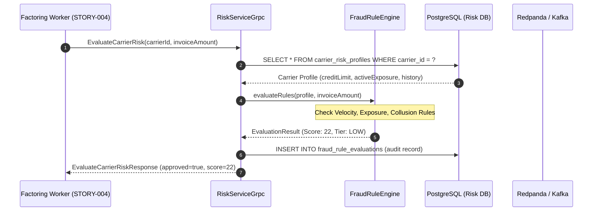

# STORY-007: Carrier Credit Risk & Fraud Evaluation Engine

## 📌 Story Overview
* **Target Module**: `smartpay-risk-service`
* **Priority**: P1 (Underwriting & Fraud Prevention)
* **Domain Context**: Risk & Underwriting Bounded Context
* **Associated Database Tables**: `carrier_risk_profiles` (`V7`), `fraud_rule_evaluations` (`V8`)
* **Associated gRPC Dependency**: `smartpay-proto/src/main/proto/risk.proto`
* **Consumer Service**: `smartpay-payout-worker` (`STORY-004`)
* **Required `smartpay-common` Components**:
  * `CarrierId`, `ShipperId`, `InvoiceId` (Strongly-typed IDs)
  * `Money` (Exposure limit, historical default exposure)
  * `RiskScore`, `RiskTier` (`LOW`, `MEDIUM`, `HIGH`, `CRITICAL`)
  * `RiskEvaluationException`, `BlacklistedEntityException`

---

## 🎯 User Story
> **As a** Risk & Underwriting Engine,  
> **I want to** evaluate carrier creditworthiness, verify factoring exposure ceilings, and calculate fraud propensity scores via gRPC,  
> **So that** instant factoring payouts are automatically halted for fraudulent or high-risk carriers before capital is disbursed.

---

## 🔄 End-to-End (E2E) Execution Flow

```
1. Factoring Pre-Disbursement Assessment
   │ Inbound RPC call: EvaluateCarrierRisk(carrierId, invoiceAmount, shipperId).
   ▼
2. Sanction & Blacklist Screening
   │ Query carrier_risk_profiles where carrier_id = :carrierId.
   │ - If status is BLACKLISTED or SANCTIONED: Return IMMEDIATE_REJECT (Score 100).
   ▼
3. Exposure Ceiling Calculation
   │ Retrieve current_active_factoring_pence + requested_amount_pence.
   │ - If cumulative exposure > max_credit_limit_pence: Flag EXPOSURE_LIMIT_EXCEEDED.
   ▼
4. Multi-Factor Fraud Heuristics Engine
   │ Evaluate automated rule pipeline:
   │ - Rule 1 (Velocity): > 3 factoring requests within 10 minutes? (+30 points)
   │ - Rule 2 (Invoice-to-Delivery Delta): ePOD verified < 15 min after invoice creation? (+25 points)
   │ - Rule 3 (Shipper-Carrier Collusion): Same bank account number or IP subnet? (+50 points)
   ▼
5. Risk Score Aggregation & Tier Classification
   │ Compute final risk score [0..100]:
   │ - LOW (0 - 25): Instant approval recommended.
   │ - MEDIUM (26 - 39): Approved with reduced advance rate (85%).
   │ - HIGH (40 - 69): Automatic hold; requires compliance approval.
   │ - CRITICAL (70 - 100): Immediate rejection.
   ▼
6. Persist Audit Trail & Return RPC Response
   │ Insert evaluation record into fraud_rule_evaluations.
   │ Return EvaluateCarrierRiskResponse(riskScore, riskTier, approved, reasoning).
```

---

## 📊 Sequence Diagram



---

## ✅ Acceptance Criteria (AC)

### AC-1: Approved Risk Evaluation for Compliant Carrier
* **Given**: An active carrier with clean history and risk score of 18 (Tier: `LOW`),
* **When**: `EvaluateCarrierRisk` is called for invoice of £1,200,
* **Then**: The response returns `approved = true`, `riskScore = 18`, and factoring advance proceeds.

### AC-2: Fraud Score Rejection Above Threshold
* **Given**: A carrier flagged for velocity anomalies with composite risk score of 72 (Tier: `CRITICAL`),
* **When**: `EvaluateCarrierRisk` is called,
* **Then**: The response returns `approved = false`, `riskScore = 72`, and reasoning `ERR_VELOCITY_ANOMALY`.

### AC-3: Exposure Limit Enforcement
* **Given**: A carrier with credit limit £10,000 and current active factoring £9,500,
* **When**: A new invoice of £1,000 is submitted for factoring evaluation,
* **Then**: The evaluation rejects with `approved = false`, reasoning `EXPOSURE_CEILING_EXCEEDED`.
