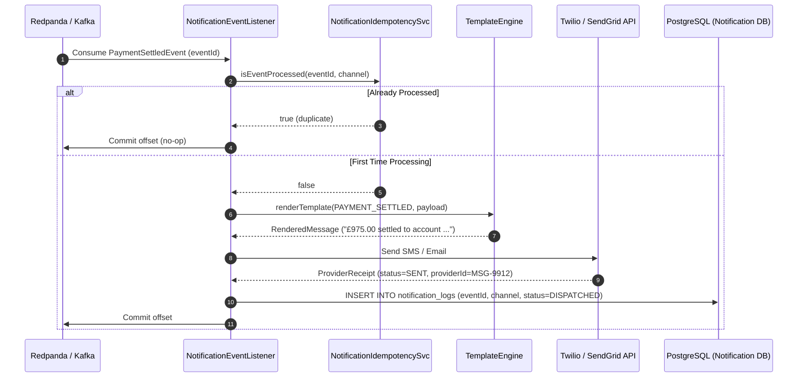

# STORY-008: Event-Driven Multi-Channel Notification Engine

## 📌 Story Overview
* **Target Module**: `smartpay-notification-service`
* **Priority**: P2 (Customer Communication & Operational Visibility)
* **Domain Context**: Communications & Notification Bounded Context
* **Associated Database Tables**: `notification_logs` (`V9`), `notification_templates` (`V10`)
* **Message Broker Topics**:
  * `smartpay.events.invoice` (`InvoiceIssuedEvent`)
  * `smartpay.events.payment` (`PaymentSettledEvent`)
  * `smartpay.events.payout` (`FactoringPayoutApprovedEvent`)
* **Required `smartpay-common` Components**:
  * `CarrierId`, `ShipperId`, `InvoiceId`, `PaymentId` (Strongly-typed IDs)
  * `Money` (Formatted invoice and disbursement values)
  * `NotificationChannel` (`SMS`, `EMAIL`, `WEBHOOK`)
  * `NotificationStatus` (`PENDING`, `DISPATCHED`, `FAILED`, `DEAD_LETTERED`)

---

## 🎯 User Story
> **As a** Shipper or Carrier,  
> **I want to** receive immediate, templated notifications (SMS, Email, Webhooks) when invoices are finalized and payouts settle,  
> **So that** financial logistics operations maintain real-time transparency without polling APIs.

---

## 🔄 End-to-End (E2E) Execution Flow

```
1. Kafka Event Ingestion
   │ Consumer group smartpay-notification-workers consumes domain events:
   │ - PaymentSettledEvent (Payout completed to carrier bank)
   │ - InvoiceIssuedEvent (New freight obligation ready for payment)
   ▼
2. Consumer Idempotency Verification
   │ Query notification_logs where event_id = :eventId AND channel = :channel.
   │ - If already present with status DISPATCHED: Acknowledge Kafka offset and skip (no duplicate SMS/Email).
   ▼
3. Template Rendering & Channel Resolution
   │ Retrieve recipient profile (email address, mobile phone, webhook URL).
   │ Render dynamic parameters: carrierName, formattedAmount (£975.00), bankRef, eta.
   ▼
4. External Provider Dispatch (Virtual Threads)
   │ Dispatch asynchronously across virtual threads:
   │ - SMS: Twilio REST API
   │ - Email: SendGrid v3 API / AWS SES
   │ - Webhook: Signed HMAC-SHA256 HTTP POST to carrier/shipper webhook endpoint
   ▼
5. Delivery Confirmation & Retry Strategy
   │ - On 2xx response: Update notification_logs SET status = 'DISPATCHED', provider_message_id = :id.
   │ - On 5xx/429: Retry with exponential backoff (up to 3 retries).
   │ - If retries exhausted: Publish to smartpay.events.notifications.dlq.
```

---

## 📊 Sequence Diagram



---

## ✅ Acceptance Criteria (AC)

### AC-1: Instant SMS on Payment Settlement
* **Given**: A `PaymentSettledEvent` published to Kafka with net payout £975.00,
* **When**: The notification service consumes the event,
* **Then**: An SMS is dispatched to the carrier's registered phone, and a log entry with status `DISPATCHED` is recorded.

### AC-2: Strict Consumer Idempotency
* **Given**: A previously processed `PaymentSettledEvent`,
* **When**: Kafka replays the message (e.g., consumer rebalance or network hiccup),
* **Then**: The notification service detects the existing log and suppresses duplicate SMS/Email sending.

### AC-3: Dead Letter Queue (DLQ) on Provider Failure
* **Given**: An external provider outage (e.g., Twilio HTTP 500),
* **When**: Retries exceed 3 attempts with backoff,
* **Then**: The event is forwarded to `smartpay.events.notifications.dlq` and flagged as `DEAD_LETTERED`.
