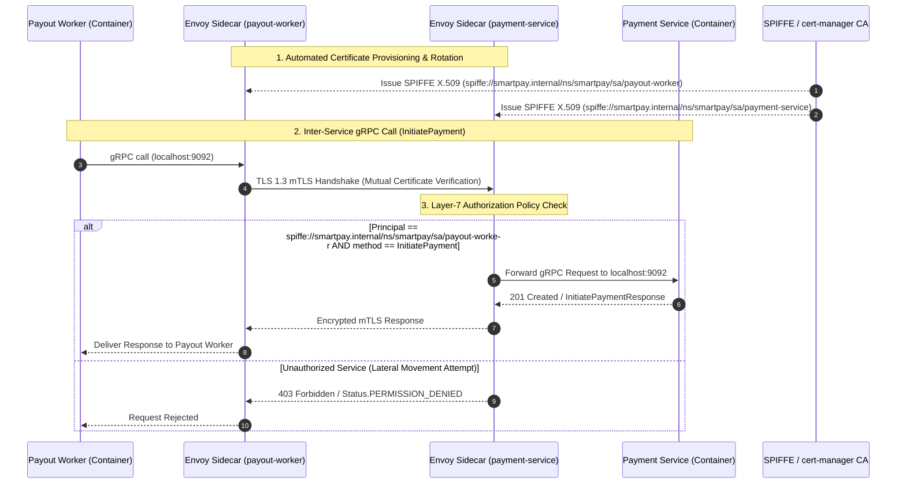

# TECH-004: Zero-Trust Inter-Service Communication & mTLS Encryption via Envoy Service Mesh

## 📌 Story Overview
* **Target Scope**: `k8s/mesh/`, `k8s/base/envoy/`, Envoy sidecars, SPIFFE/X.509 mTLS certificates, L7 authorization policies
* **Priority**: P1 (Zero-Trust Security & Transport Encryption)
* **Domain Context**: Platform Security & Networking Infrastructure
* **Components Covered**:
  * Envoy Sidecar Proxy Injection across all 8 microservices
  * Automatic Mutual TLS (mTLS) with SPIFFE X.509 certificate issuance and automated rotation
  * Strict mTLS PeerAuthentication policy (`mode: STRICT`: rejects plaintext TCP/HTTP)
  * Layer-7 Service-to-Service AuthorizationPolicies (least-privilege RBAC per SPIFFE identity)
  * Envoy gRPC access logging, distributed tracing header propagation (`x-request-id`, W3C tracecontext), and circuit breaking

---

## 🎯 User Story
> **As a** Platform Security & DevOps Engineer,  
> **I want to** deploy an Envoy-based Service Mesh with strict mTLS and cryptographically verified SPIFFE service identities,  
> **So that** all inter-service gRPC and REST communication is encrypted in transit and unauthorized lateral movement between microservices is blocked.

---

## 🏗️ Architecture & Traffic Flow



---

## 📋 Detailed Component Specifications

### 1. Envoy Sidecar Proxy Injection
* Every microservice pod deployment (`smartpay-gateway`, `smartpay-ledger-service`, `smartpay-payment-service`, `smartpay-invoice-service`, `smartpay-payout-worker`, `smartpay-recon-service`, `smartpay-risk-service`, `smartpay-notification-service`) receives an injected Envoy sidecar proxy.
* Transparent proxying via `iptables` rules redirecting inbound traffic to port `15006` and outbound traffic to port `15001`.

### 2. SPIFFE/X.509 Identity & Automated Certificate Lifecycle
* **Identity URI Format**: `spiffe://smartpay.internal/ns/{namespace}/sa/{serviceaccount-name}`.
* Automatic certificate rotation with short validity windows ($24\text{ hours}$) managed via `cert-manager` / SPIRE.
* Zero application code changes required; certificate negotiation happens entirely between Envoy sidecars.

### 3. Strict PeerAuthentication (Reject Plaintext)
```yaml
apiVersion: security.istio.io/v1beta1
kind: PeerAuthentication
metadata:
  name: default
  namespace: smartpay
spec:
  mtls:
    mode: STRICT # Rejects any plaintext TCP, HTTP, or gRPC traffic
```

### 4. Layer-7 AuthorizationPolicies (Zero-Trust Principle of Least Privilege)
Enforces granular access control per service identity:
* **Payment Service Policy**: Only `smartpay-payout-worker` and `smartpay-gateway` can invoke payment endpoints:
```yaml
apiVersion: security.istio.io/v1beta1
kind: AuthorizationPolicy
metadata:
  name: payment-service-rbac
  namespace: smartpay
spec:
  selector:
    matchLabels:
      app.kubernetes.io/name: smartpay-payment-service
  action: ALLOW
  rules:
    - from:
        - source:
            principals:
              - "cluster.local/ns/smartpay/sa/smartpay-payout-worker"
              - "cluster.local/ns/smartpay/sa/smartpay-gateway"
      to:
        - operation:
            ports: ["8082", "9092"]
```
* **Ledger Service Policy**: Only `smartpay-payment-service`, `smartpay-recon-service`, and `smartpay-gateway` can connect to ledger gRPC/REST. All other identities are denied.

---

## ✅ Acceptance Criteria (AC)

### AC-1: Strict mTLS Transport Encryption
* **Given**: Two microservices communicating in the cluster,
* **When**: Traffic is transmitted between pods,
* **Then**: Communication is encrypted with TLS 1.3 mutual authentication; plaintext connection attempts are rejected with connection resets (`ECONNRESET`).

### AC-2: Cryptographic SPIFFE Service Identity Validation
* **Given**: An incoming gRPC or REST call,
* **When**: The receiving Envoy proxy evaluates the client certificate,
* **Then**: The client's SPIFFE ID is extracted from SAN (Subject Alternative Name) and validated against the trusted CA.

### AC-3: Layer-7 Zero-Trust Access Control (Least Privilege)
* **Given**: An unauthorized service attempting to call `smartpay-ledger-service` directly,
* **When**: The request hits the ledger Envoy sidecar,
* **Then**: The request is denied with HTTP `403 Forbidden` / gRPC `Status.PERMISSION_DENIED`.

### AC-4: Non-Blocking Project Loom Compatibility
* **Given**: Java 25 Virtual Threads making outbound gRPC calls,
* **When**: Traffic passes through the local Envoy sidecar,
* **Then**: HTTP/2 multiplexing operates transparently without pinning Loom carrier threads.
