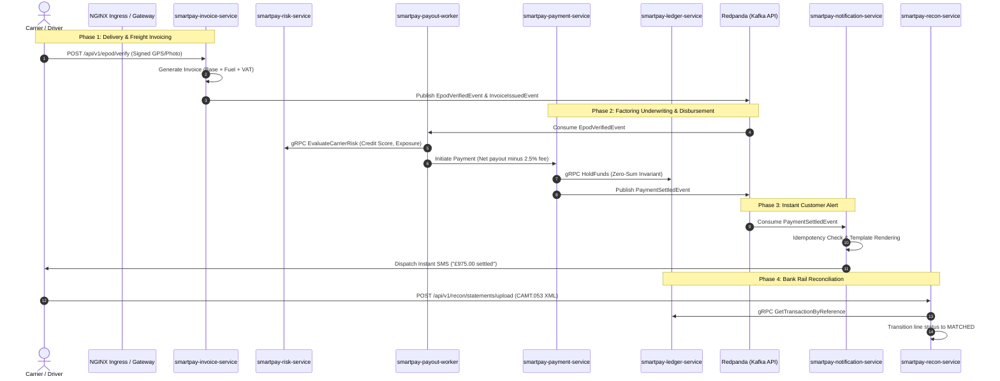

# SmartPay Cloud-Native End-to-End (E2E) Test Suite

This directory documents and supports the automated End-to-End (E2E) test suite for the SmartPay Logistics Payment Platform, verifying all 7 bounded contexts in real Kubernetes (KinD) environments.

---

## 🗺️ Multi-Service E2E Lifecycle Flow



---

## 🚀 Execution Commands

### 1. One-Command Automated KinD Bootstrap & E2E Run
To spin up an ephemeral KinD multi-node cluster, install NGINX ingress, deploy PostgreSQL 16 & Redpanda, run all Flyway migrations, build/load container images, rollout microservices, and execute E2E tests:

```bash
chmod +x scripts/ci/kind-setup.sh
./scripts/ci/kind-setup.sh smartpay-cluster
```

### 2. Run the Full 10-Phase Lifecycle Test
To exercise all 10 stages of the end-to-end journey against an existing environment:

```bash
chmod +x scripts/ci/e2e-full-lifecycle-test.sh
./scripts/ci/e2e-full-lifecycle-test.sh
```

### 3. Run the Fast Idempotency & Tamper Smoke Test
```bash
chmod +x scripts/ci/e2e-smoke-test.sh
BASE_URL="http://localhost:8082" NOTIFICATION_URL="http://localhost:8087" ./scripts/ci/e2e-smoke-test.sh
```

---

## 🔍 Kafka / Redpanda Topic & Consumer Group Inspection

We provide a dedicated CLI tool `scripts/ci/inspect-kafka-topics.sh` that inspects live Kafka brokers in KinD, Docker, or local environments:

```bash
# 1. View all active topics and consumer groups
./scripts/ci/inspect-kafka-topics.sh summary

# 2. View recent messages published to the payment settlement stream
./scripts/ci/inspect-kafka-topics.sh consume smartpay.events.payment 5

# 3. View messages on the freight invoice stream
./scripts/ci/inspect-kafka-topics.sh consume smartpay.events.invoice 5

# 4. Inspect consumer groups, partition offsets, and consumer lag
./scripts/ci/inspect-kafka-topics.sh lag

# 5. Inspect the Dead Letter Queue (DLQ)
./scripts/ci/inspect-kafka-topics.sh dlq
```

### Direct `kubectl exec` Inspection Commands (inside KinD)
```bash
# List all topics
kubectl exec -n smartpay deployment/redpanda -- rpk topic list

# Consume JSON event messages in real time
kubectl exec -n smartpay deployment/redpanda -- rpk topic consume smartpay.events.payment -n 1 --format json

# Check consumer group lag for notification workers
kubectl exec -n smartpay deployment/redpanda -- rpk group describe smartpay-notification-workers

# Check consumer group lag for factoring payout workers
kubectl exec -n smartpay deployment/redpanda -- rpk group describe smartpay-factoring-workers
```
